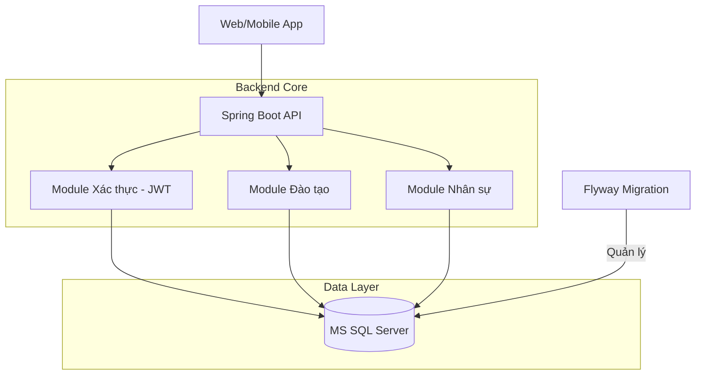

# 🎓 UEMS - University Education Management System
### *Giải pháp quản trị đào tạo đại học toàn diện trên nền tảng Spring Boot 3*

---

## 🌟 1. Giới thiệu hệ thống (Introduction)

**UEMS (University Education Management System)** là hệ thống quản lý đào tạo được thiết kế để giải quyết bài toán chuyển đổi số trong giáo dục đại học. Hệ thống tập trung vào việc tự động hóa các quy trình phức tạp, từ quản lý hồ sơ nhân sự, sinh viên đến việc tổ chức đào tạo và đánh giá kết quả học tập.

Hệ thống được xây dựng với mục tiêu:
- **Tập trung hóa dữ liệu:** Kết nối mọi thực thể (Sinh viên, Giảng viên, Phòng ban) trên một nền tảng duy nhất.
- **Tối ưu hóa quy trình:** Giảm thiểu thao tác thủ công trong đăng ký học phần và quản lý điểm.
- **Bảo mật tuyệt đối:** Áp dụng các tiêu chuẩn bảo mật hiện đại nhất cho dữ liệu giáo dục.

---

## 🏗 2. Kiến trúc hệ thống (System Architecture)

Dự án áp dụng mô hình **Domain-Driven Design (DDD)** kết hợp với **Clean Architecture**, giúp tách biệt rõ ràng giữa logic nghiệp vụ và hạ tầng kỹ thuật.



---

## 🚀 3. Các phân hệ chức năng chính (Core Modules)

### 🔐 Phân hệ Quản trị & Bảo mật
- **Xác thực đa tầng:** JWT Stateless Authentication.
- **Phân quyền RBAC:** Kiểm soát truy cập dựa trên vai trò (Admin, Staff, Lecturer, Student).
- **Audit Logs:** Theo dõi và truy vết mọi hoạt động thay đổi dữ liệu nhạy cảm.

### 📚 Phân hệ Quản lý Đào tạo
- **Chương trình đào tạo:** Quản lý khung chương trình theo ngành, khóa học và môn học tiên quyết.
- **Lớp học phần:** Tổ chức lớp, sắp xếp thời khóa biểu và phòng học linh hoạt.
- **Đăng ký học phần:** Luồng nghiệp vụ đăng ký trực tuyến với kiểm soát sĩ số và điều kiện môn học.

### 🎓 Phân hệ Quản lý Người học (Student Lifecycle)
- **Hồ sơ 360:** Quản lý toàn bộ thông tin từ lúc nhập học đến khi tốt nghiệp.
- **Theo dõi tiến độ:** Quản lý điểm chuyên cần, điểm thành phần và tính toán GPA tự động.

---

## 🛠 4. Đặc tính kỹ thuật nổi bật (Technical Highlights)

- **Flyway Migration:** Đảm bảo mọi thay đổi cấu trúc Database đều được lưu vết và đồng bộ hóa tự động.
- **UUID Strategy:** 100% ID trong hệ thống sử dụng UUID v4, ngăn chặn việc khai thác dữ liệu qua ID tuần tự.
- **Soft Delete:** Bảo vệ dữ liệu khỏi việc xóa nhầm, cho phép khôi phục dữ liệu dễ dàng.
- **Standardized Response:** Sử dụng cấu trúc `ApiResponse` thống nhất cho toàn bộ hệ thống, giúp Frontend dễ dàng tích hợp.

---

## 📦 5. Hướng dẫn cài đặt nhanh (Quick Start)

1.  **Yêu cầu:** Java 17, Maven 3.8, SQL Server.
2.  **Khởi tạo DB:** Tạo database `UniversityManagement` trên SQL Server.
3.  **Chạy ứng dụng:**
    ```powershell
    cd backend
    ./mvnw.cmd spring-boot:run
    ```
4.  **Tài khoản mặc định:**
    - **Username:** `admin`
    - **Password:** `123456`
    - **Swagger UI:** [http://localhost:8081/](http://localhost:8081/)

---

## 👨‍💻 6. Đội ngũ phát triển
- **Dự án:** Đồ án tốt nghiệp K22.
- **Trạng thái:** Phiên bản 1.0 (Development).
