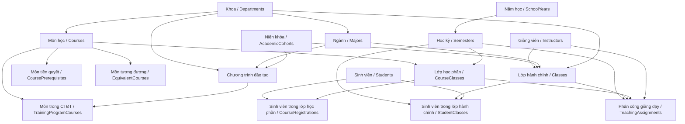

# Workflow cấu hình đào tạo, lớp học phần và phân công giảng dạy

Tài liệu này mô tả workflow FE/BA cho chuỗi nghiệp vụ:

`Khoa -> Ngành -> Niên khóa -> Năm học -> Học kỳ -> Môn học -> Lớp hành chính -> Chương trình đào tạo -> Môn trong chương trình -> Môn tiên quyết/tương đương -> Lớp học phần -> Sinh viên trong lớp học phần -> Phân công giảng viên`.

## 1. Thứ tự cấu hình chuẩn

```text
1. Tạo khoa
2. Tạo ngành thuộc khoa
3. Tạo niên khóa đào tạo
4. Tạo năm học
5. Tạo học kỳ thuộc năm học
6. Tạo môn học thuộc khoa
7. Tạo lớp hành chính theo khoa/ngành/niên khóa
8. Tạo chương trình đào tạo theo khoa/ngành/niên khóa
9. Gán môn vào chương trình đào tạo
10. Thiết kế môn tiên quyết, học song hành, môn tương đương
11. Mở lớp học phần theo học kỳ
12. Gán sinh viên vào lớp hành chính
13. Gán sinh viên vào lớp học phần
14. Phân công giảng viên dạy lớp học phần
```

## 2. Sơ đồ quan hệ



## 3. Khoa

Mục đích:

- Đơn vị quản lý ngành, môn học, chương trình đào tạo, lớp hành chính.

API hiện có:

```text
GET    /api/v1/departments/admin
POST   /api/v1/departments/admin
PUT    /api/v1/departments/admin/{id}
DELETE /api/v1/departments/admin/{id}
```

Validate service:

- Mã khoa và tên khoa bắt buộc.
- Mã khoa được chuẩn hóa uppercase.
- Không cho trùng mã.
- Xóa là soft delete: `isActive=false`, `deletedAt`.

FE:

- Form: `code`, `name`, `description`, `isActive`.
- Khoa là dropdown đầu vào cho ngành, môn học, lớp hành chính, chương trình đào tạo.

## 4. Ngành

Mục đích:

- Ngành thuộc một khoa.
- Dùng để lọc chương trình đào tạo, lớp hành chính và sinh viên.

API hiện có:

```text
GET    /api/v1/majors/admin
POST   /api/v1/majors/admin
PUT    /api/v1/majors/admin/{id}
DELETE /api/v1/majors/admin/{id}
```

Validate service:

- Mã ngành, tên ngành, khoa bắt buộc.
- Khoa phải tồn tại.
- Mã ngành không trùng.
- Mã ngành uppercase.

FE:

- Khi chọn khoa, load ngành theo `departmentId`.

## 5. Niên khóa đào tạo

Mục đích:

- Đại diện khóa tuyển sinh/khóa đào tạo, ví dụ `K2025`.

API hiện có:

```text
GET    /api/v1/academic-cohorts/admin
POST   /api/v1/academic-cohorts/admin
PUT    /api/v1/academic-cohorts/admin/{id}
DELETE /api/v1/academic-cohorts/admin/{id}
```

FE:

- Form: `code`, `name`, `startYear`, `endYear`, `startDate`, `endDate`, `isActive`.
- Niên khóa dùng trong chương trình đào tạo và lớp hành chính.

## 6. Năm học và học kỳ

Mục đích:

- `SchoolYears` quản lý năm đào tạo.
- `Semesters` thuộc năm học, là trục để mở lớp học phần, phân công giảng dạy, đăng ký học phần.

API hiện có:

```text
GET    /api/v1/school-years/admin
POST   /api/v1/school-years/admin
PUT    /api/v1/school-years/admin/{id}
DELETE /api/v1/school-years/admin/{id}

GET    /api/v1/semesters/admin
POST   /api/v1/semesters/admin
PUT    /api/v1/semesters/admin/{id}
DELETE /api/v1/semesters/admin/{id}
```

Validate service:

- Năm học: `startDate < endDate`, mã không trùng.
- Học kỳ: thuộc năm học, ngày bắt đầu/kết thúc nằm trong năm học, mã học kỳ không trùng trong cùng năm học.

FE:

- Tạo năm học trước.
- Tạo học kỳ sau, bắt buộc chọn năm học.
- Khi mở lớp học phần, dùng học kỳ làm filter chính.

## 7. Môn học

Mục đích:

- Danh mục học phần, có khoa quản lý, số tín chỉ, số tiết.

API hiện có:

```text
GET    /api/v1/courses
GET    /api/v1/courses/{id}
GET    /api/v1/courses/department/{departmentId}
POST   /api/v1/courses
PUT    /api/v1/courses/{id}
DELETE /api/v1/courses/{id}
```

Validate service:

- Tín chỉ phải > 0 và <= 10.
- Số tiết lý thuyết/thực hành không âm.
- Mã môn không trùng.
- Nếu môn đã có lớp học phần, không cho đổi mã môn, tín chỉ, khoa quản lý.

FE:

- Môn học là nguồn để gán vào chương trình đào tạo và mở lớp học phần.
- Nên hiển thị `courseType`, `credits`, `theoryHours`, `practiceHours`.

## 8. Lớp hành chính

Mục đích:

- Lớp quản lý sinh viên theo khoa/ngành/niên khóa.
- Có thể có giai đoạn:
  - `FOUNDATION`: lớp giai đoạn đại cương/cơ sở.
  - `SPECIALIZATION`: lớp sau khi chia chuyên ngành.

API hiện có:

```text
GET    /api/v1/classes/admin
POST   /api/v1/classes/admin
PUT    /api/v1/classes/admin/{id}
DELETE /api/v1/classes/admin/{id}
```

Validate service:

- Mã lớp, tên lớp, khoa, niên khóa bắt buộc.
- Mã lớp không trùng.
- Ngành phải thuộc khoa.
- Nếu có chuyên ngành, chuyên ngành phải thuộc đúng khoa/ngành.
- Nếu `classPhase = SPECIALIZATION`, bắt buộc chọn chuyên ngành.
- Một giảng viên cố vấn chỉ được gán cho một lớp hành chính active.
- `maxSize > 0`.

FE:

- Chọn khoa -> filter ngành.
- Nếu giai đoạn chuyên ngành thì mở dropdown chuyên ngành.
- Advisor là giảng viên, chỉ nên hiển thị giảng viên chưa được gán lớp active.

## 9. Chương trình đào tạo

Mục đích:

- Chương trình theo khoa/ngành/niên khóa.
- Có thể là chương trình cơ sở chung hoặc chương trình chuyên ngành.

API hiện có:

```text
GET    /api/v1/training-programs/admin
POST   /api/v1/training-programs/admin
PUT    /api/v1/training-programs/admin/{id}
DELETE /api/v1/training-programs/admin/{id}
```

Validate service:

- Mã, tên, khoa, niên khóa bắt buộc.
- Khoa phải tồn tại.
- Ngành phải thuộc khoa.
- Chuyên ngành phải thuộc khoa/ngành.
- Nếu `programPhase = SPECIALIZATION`, bắt buộc chọn ngành và chuyên ngành.
- `durationYears <= maxDurationYears`.
- `effectiveDate <= expiryDate`.

FE:

- Tạo chương trình sau khi có khoa/ngành/niên khóa.
- Với chương trình cơ sở chung, `specializationId` có thể null.
- Với chương trình chuyên ngành, bắt buộc chọn chuyên ngành.

## 10. Môn trong chương trình đào tạo

Mục đích:

- Gán môn vào chương trình đào tạo theo kỳ/giai đoạn.
- Phân biệt môn cơ sở chung và môn chuyên sâu.

Entity chính:

```text
TrainingProgramCourses
```

Các field quan trọng:

| Field | Ý nghĩa |
|---|---|
| `trainingProgramId` | Chương trình đào tạo |
| `courseId` | Môn học |
| `semesterId` | Kỳ dự kiến học |
| `coursePhase` | `FOUNDATION` hoặc `SPECIALIZATION` |
| `isRequired` | Bắt buộc/tự chọn |
| `prerequisiteCourseId` | Môn tiên quyết trong CTĐT |
| `isPrerequisiteRequired` | Có bắt buộc tiên quyết hay không |
| `sortOrder` | Thứ tự hiển thị |
| `status` | Trạng thái |

API hiện có:

```text
GET /api/v1/training-program-courses/admin
GET /api/v1/training-program-courses/admin/by-student/{studentId}
```

Ghi chú backend:

- Hiện controller mới có API lọc/xem.
- Việc thêm/sửa/xóa môn trong chương trình đào tạo hiện chưa có controller CRUD riêng, nhưng entity/repository đã có và test workflow đang seed trực tiếp bằng repository.

FE workflow đề xuất khi có CRUD:

```text
Chọn chương trình đào tạo
  -> Chọn học kỳ dự kiến
  -> Chọn phase FOUNDATION/SPECIALIZATION
  -> Chọn môn học
  -> Nhập tín chỉ/required/sortOrder
  -> Chọn môn tiên quyết nếu có
```

## 11. Môn tiên quyết, song hành, tương đương

### 11.1. CoursePrerequisites

API hiện có:

```text
GET    /api/v1/course-prerequisites/admin/course/{courseId}
POST   /api/v1/course-prerequisites/admin
GET    /api/v1/course-prerequisites/admin/check?courseId={courseId}&prereqId={prereqId}
DELETE /api/v1/course-prerequisites/admin?courseId={courseId}&prereqId={prereqId}
```

Các type hỗ trợ:

```text
PREREQUISITE
PARALLEL
COREQUISITE
```

Validate service đã bổ sung:

- Không được để trống course/prerequisite.
- Môn học không được tự là môn tiên quyết/tương đương của chính nó.
- Không cho tạo trùng quan hệ active.
- Xóa là soft delete quan hệ.

### 11.2. EquivalentCourses

Entity đã có:

```text
EquivalentCourses
```

Ghi chú backend:

- Hiện mới có repository/entity, chưa có controller/service CRUD riêng.
- Nếu FE cần màn hình quản lý môn tương đương, backend nên bổ sung API admin riêng:

```text
GET    /api/v1/equivalent-courses/admin?courseId=
POST   /api/v1/equivalent-courses/admin
DELETE /api/v1/equivalent-courses/admin/{id}
```

## 12. Lớp học phần

Mục đích:

- Lớp học phần là lớp mở theo môn và học kỳ.
- Dùng để xếp lịch, phân công giảng viên, gán sinh viên, nhập điểm.

API hiện có:

```text
GET    /api/v1/courses/classes
GET    /api/v1/courses/classes/{id}
GET    /api/v1/courses/classes/semester/{semesterId}
GET    /api/v1/courses/{courseId}/classes
POST   /api/v1/courses/classes
PUT    /api/v1/courses/classes/{id}
DELETE /api/v1/courses/classes/{id}
```

Validate service đã bổ sung:

- Bắt buộc mã lớp học phần, học kỳ, môn học.
- Môn học phải tồn tại và active.
- Học kỳ phải tồn tại.
- Không trùng `classCode + semesterId + courseId`.
- `maxStudent > 0`.
- `currentStudent >= 0`.
- `currentStudent <= maxStudent`.
- `startDate/endDate` phải nằm trong học kỳ.

FE:

- Filter chính theo học kỳ.
- Khi tạo lớp: chọn học kỳ -> chọn môn -> nhập mã lớp, sĩ số, ngày bắt đầu/kết thúc.
- Sau khi có lớp học phần, tiếp tục gán lịch/phòng và phân công giảng viên.

## 13. Gán sinh viên vào lớp hành chính

API hiện có:

```text
GET    /api/v1/student-classes/admin
POST   /api/v1/student-classes/admin
PUT    /api/v1/student-classes/admin/{id}
DELETE /api/v1/student-classes/admin/{id}
```

Validate service:

- Sinh viên, lớp hành chính, học kỳ phải tồn tại.
- Sinh viên và lớp phải active.
- Lớp phải cùng niên khóa/khoa/ngành/chuyên ngành với sinh viên nếu các field có cấu hình.
- Một sinh viên chỉ có một lớp hành chính active trong một học kỳ.
- Không vượt `maxSize`.

FE:

- Trong màn hình lớp hành chính, tab `Sinh viên`.
- Có thể chọn nhiều sinh viên cùng khoa/ngành/niên khóa để gán.

## 14. Gán sinh viên vào lớp học phần

Entity chính:

```text
CourseRegistrations
```

Mục đích:

- Lưu danh sách sinh viên thuộc lớp học phần.
- Dùng cho lịch học sinh viên, điểm, học phí, học lại/cải thiện.

Ghi chú backend:

- Đã có service/API cho sinh viên đăng ký học lại/cải thiện.
- Chức năng admin gán học phần mặc định lần đầu theo chương trình đào tạo hiện chưa có controller/service CRUD riêng.
- Trong workflow test, bản ghi `CourseRegistrations` được seed bằng repository để xác nhận mô hình dữ liệu.

API học lại/cải thiện đã có:

```text
GET  /api/v1/students/me/retake-improvement-registrations/options
POST /api/v1/students/me/retake-improvement-registrations
```

API admin nên bổ sung tiếp:

```text
GET    /api/v1/admin/course-classes/{courseClassId}/students
POST   /api/v1/admin/course-classes/{courseClassId}/students
DELETE /api/v1/admin/course-classes/{courseClassId}/students/{studentId}
```

Validate admin gán mặc định nên có:

- Sinh viên thuộc đúng chương trình đào tạo có môn đó.
- Lớp còn chỗ.
- Không trùng học phần trong học kỳ.
- Không trùng lịch.
- Tăng/giảm `CourseClasses.CurrentStudent`.

## 15. Phân công giảng viên dạy lớp học phần

Entity:

```text
TeachingAssignments
```

API hiện có:

```text
GET  /api/v1/teaching-assignments/admin
POST /api/v1/teaching-assignments/admin
```

Request:

```json
{
  "instructorId": "uuid",
  "courseClassId": "uuid",
  "classId": "uuid",
  "semesterId": "uuid",
  "note": "Phân công chính",
  "isActive": true
}
```

Validate service:

- Giảng viên phải tồn tại.
- Lớp học phần phải tồn tại.
- Lớp hành chính phải tồn tại.
- Học kỳ phân công phải khớp học kỳ của lớp học phần.
- Không cho một lớp học phần có nhiều giảng viên active trong cùng học kỳ.
- Không cho trùng bản ghi `instructorId + courseClassId + classId + semesterId`.

FE:

- Màn hình phân công nên hiển thị:
  - Giảng viên
  - Mã lớp học phần
  - Môn học
  - Lớp hành chính
  - Học kỳ
  - Trạng thái active/inactive
  - Ghi chú

## 16. Auto test đã thêm

File:

```text
backend/src/test/java/com/quanlydaotao/backend/workflow/AcademicSetupWorkflowTest.java
```

Test kiểm tra:

- Tạo khoa.
- Tạo ngành thuộc khoa.
- Tạo niên khóa.
- Tạo năm học và học kỳ.
- Tạo giảng viên cố vấn và giảng viên dạy.
- Tạo lớp hành chính theo khoa/ngành/niên khóa.
- Tạo chương trình đào tạo.
- Tạo môn cơ sở, môn chuyên sâu, môn tương đương.
- Gán môn vào chương trình đào tạo với `FOUNDATION` và `SPECIALIZATION`.
- Tạo quan hệ môn tiên quyết.
- Tạo lớp học phần.
- Gán sinh viên vào lớp hành chính.
- Gán sinh viên vào lớp học phần qua `CourseRegistrations`.
- Phân công giảng viên dạy lớp học phần.
- Chặn cố vấn bị gán cho lớp hành chính khác.
- Chặn lớp học phần trùng mã trong cùng kỳ/môn.
- Chặn môn tự làm tiên quyết của chính nó.
- Chặn phân công giảng viên không tồn tại.

Kết quả chạy:

```text
.\mvnw.cmd compile      -> BUILD SUCCESS
.\mvnw.cmd test-compile -> BUILD SUCCESS
.\mvnw.cmd test         -> BUILD SUCCESS
```

Lưu ý:

- Các workflow test dùng Testcontainers PostgreSQL nên hiện bị skip nếu máy không có Docker.
- Điều này không ảnh hưởng compile/build, nhưng để chạy test workflow thật sự cần bật Docker hoặc cấu hình profile test riêng trỏ tới PostgreSQL test database.

## 17. Các điểm nên bổ sung backend tiếp

Các phần sau đã có entity/repository hoặc một phần service, nhưng chưa đủ API CRUD/admin hoàn chỉnh:

1. CRUD môn trong chương trình đào tạo (`TrainingProgramCourses`) thay vì chỉ search.
2. CRUD môn tương đương (`EquivalentCourses`) thay vì chỉ repository.
3. Admin gán sinh viên vào lớp học phần lần đầu theo chương trình đào tạo.
4. API xem danh sách sinh viên trong một lớp học phần cho admin.
5. API cập nhật trạng thái phân công giảng dạy, hủy/đổi giảng viên nếu chưa phát sinh lịch/điểm.
