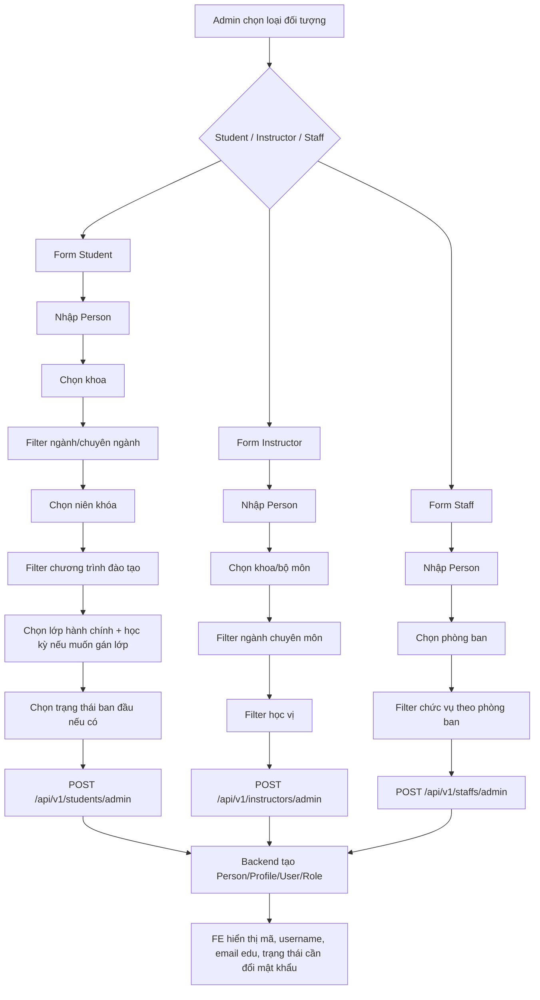

# Workflow admin tạo tài khoản và đối tượng

Tài liệu này mô tả luồng FE/BA cho chức năng admin tạo `Student`, `Instructor`, `Staff`.
Backend tạo tài khoản tập trung trong `AccountServiceImpl`; controller/service của từng đối tượng chỉ nhận request đúng nghiệp vụ rồi ủy quyền sang AccountService.

## 1. API chính

```text
POST /api/v1/students/admin
POST /api/v1/instructors/admin
POST /api/v1/staffs/admin
```

Response luôn là:

```json
{
  "success": true,
  "message": "...",
  "data": {
    "personId": "uuid",
    "studentId": "uuid",
    "employeeId": "uuid",
    "userId": "uuid",
    "type": "STUDENT | INSTRUCTOR | STAFF",
    "roleCode": "STUDENT | LECTURER | STAFF",
    "generatedCode": "mã đối tượng chính",
    "studentCode": "mã sinh viên nếu tạo sinh viên",
    "employeeCode": "mã nhân viên nếu tạo giảng viên/nhân viên",
    "instructorCode": "mã giảng viên nếu tạo giảng viên",
    "staffCode": "mã nhân viên hành chính nếu tạo staff",
    "username": "tên đăng nhập",
    "emailEdu": "email hệ thống",
    "initialPassword": "ddMMyyyy",
    "confirmationToken": "token xác nhận",
    "confirmationLink": "link đổi mật khẩu/xác nhận",
    "requirePasswordChange": true
  }
}
```

## 2. Quy tắc tự sinh chung

| Field | Cách xử lý |
|---|---|
| `personId` | Backend tự sinh UUID khi lưu `Persons`. |
| `studentId` | Backend tự sinh UUID khi tạo `Students`. |
| `employeeId` | Backend tự sinh UUID khi tạo `Employees` cho instructor/staff. |
| `userId` | Backend tự sinh UUID khi tạo `Users`. |
| `studentCode` | Nếu admin không nhập, backend lấy mã số lớn nhất hiện có rồi +1, mặc định bắt đầu sau `100000`. |
| `employeeCode` | Nếu admin không nhập, backend sinh theo năm hiện tại: `yyyy000 + 1`, ví dụ năm 2026 là `2026001`. |
| `instructorCode` | Nếu admin không nhập, backend sinh `GV` + `employeeCode`. |
| `staffCode` | Nếu admin không nhập, backend sinh `NV` + `employeeCode`. |
| `username` | Sinh viên dùng `studentCode`; giảng viên dùng `instructorCode` viết thường; staff dùng `staffCode` viết thường. |
| `emailEdu` | `{firstNameNoAccent}{username}@donga.edu.vn`. Ví dụ `sinhvien100001@donga.edu.vn`. |
| `initialPassword` | Ngày sinh định dạng `ddMMyyyy`. Ví dụ `02/09/2004` thành `02092004`. |
| `requirePasswordChange` | Luôn `true` khi tạo mới. Lần đăng nhập đầu phải đổi mật khẩu. |
| `emailConfirmed` | Ban đầu `false`. Backend tạo `confirmationToken` và `confirmationLink`. |
| `roleCode` | Sinh viên `STUDENT`, giảng viên `LECTURER`, nhân viên hành chính `STAFF`. |

Lưu ý: FE có thể hiển thị mã tự sinh sau khi tạo thành công. Nếu admin muốn nhập tay mã, backend vẫn nhận nhưng sẽ kiểm tra trùng.

## 3. Form thông tin cá nhân dùng chung

Các form tạo sinh viên, giảng viên, staff đều có nhóm `Persons`.

| Field | Bắt buộc | Ghi chú |
|---|---:|---|
| `fullName` | Có | Họ tên có dấu. |
| `fullNameNoAccent` | Không | Nếu không truyền, backend tự lấy tên cuối và bỏ dấu để ghép email. FE nên truyền để kiểm soát email. |
| `dateOfBirth` | Có | Dùng để sinh mật khẩu mặc định. |
| `gender` | Không | Nam/nữ/khác tùy catalog FE. |
| `placeOfBirth` | Không | Nơi sinh. |
| `ethnicity` | Không | Dân tộc. |
| `personalIdentificationNumber` | Không | Nếu truyền, backend kiểm tra không trùng CCCD/CMND active. |
| `dateOfIssue` | Không | Ngày cấp CCCD/CMND. |
| `cardPlace` | Không | Nơi cấp. |
| `nationality` | Không | Quốc tịch. |
| `contactEmail` | Không | Email cá nhân, không phải email edu. |
| `phoneNumber` | Không | Số điện thoại. |
| `permanentAddress` | Không | Địa chỉ thường trú. |
| `temporaryAddress` | Không | Địa chỉ tạm trú. |
| `avatarUrl` | Không | Ảnh đại diện. |
| `note` | Không | Ghi chú. |

## 4. Tạo sinh viên

API:

```text
POST /api/v1/students/admin
```

### 4.1. Input riêng cho sinh viên

| Field | Bắt buộc | Tự sinh được | Ghi chú |
|---|---:|---:|---|
| `studentCode` | Không | Có | Mã sinh viên. Nếu bỏ trống backend tự sinh. |
| `departmentId` | Có | Không | Khoa. |
| `majorId` | Không | Không | Ngành. Có thể null ở giai đoạn cơ sở chung nếu nghiệp vụ chưa chia ngành/chuyên ngành. |
| `specializationId` | Không | Không | Chuyên ngành. Chỉ chọn khi đã chia chuyên ngành. |
| `trainingProgramId` | Không | Không | Chương trình đào tạo. Nếu chọn thì phải khớp khoa/ngành/chuyên ngành/khóa. |
| `academicCohortId` | Có | Không | Niên khóa đào tạo. |
| `classId` | Không | Không | Lớp hành chính. Nếu chọn thì phải truyền thêm `semesterId`. |
| `semesterId` | Không | Không | Học kỳ dùng để ghi vào `StudentClasses`. |
| `admissionDate` | Không | Không | Ngày nhập học. |
| `studentStatusId` | Không | Không | Trạng thái ban đầu trong `StudentStatusCatalog`. |
| `studentStatusStartDate` | Không | Không | Ngày bắt đầu trạng thái. Nếu bỏ trống service trạng thái dùng ngày hiện tại. |
| `studentStatusReason` | Không | Không | Lý do ghi lịch sử trạng thái. |

### 4.2. Filter FE nên làm

```text
Chọn khoa
  -> load ngành theo departmentId
  -> load chuyên ngành theo departmentId + majorId nếu có
  -> load niên khóa
  -> load chương trình đào tạo theo departmentId + majorId + specializationId + academicCohortId
  -> load lớp hành chính theo departmentId + majorId + specializationId + academicCohortId
  -> load học kỳ active để gán StudentClasses
  -> load trạng thái sinh viên active
```

### 4.3. Validate backend

- `fullName`, `dateOfBirth`, `departmentId`, `academicCohortId` bắt buộc.
- `personalIdentificationNumber` không được trùng người active.
- Khoa phải tồn tại và active.
- Niên khóa phải tồn tại và active.
- Nếu chọn ngành, ngành phải tồn tại, active và thuộc khoa.
- Nếu chọn chuyên ngành, bắt buộc có ngành; chuyên ngành phải active và thuộc đúng khoa/ngành.
- Nếu chọn chương trình đào tạo, chương trình phải active và thuộc đúng khoa/khóa.
- Nếu chương trình đào tạo thuộc ngành, request phải chọn đúng ngành.
- Nếu chương trình đào tạo thuộc chuyên ngành, request phải chọn đúng chuyên ngành.
- Nếu chọn lớp hành chính, bắt buộc có học kỳ.
- Lớp hành chính phải active, còn sĩ số, cùng khoa/ngành/chuyên ngành/niên khóa với sinh viên.
- Một sinh viên chỉ có một lớp hành chính active trong một học kỳ.
- Nếu chọn trạng thái ban đầu, trạng thái phải active và backend ghi `StudentStatusHistories`.

### 4.4. Ghi dữ liệu

```text
Persons
Students
StudentClasses nếu có classId
StudentStatusHistories nếu có studentStatusId
Users
UserRoles
```

## 5. Tạo giảng viên

API:

```text
POST /api/v1/instructors/admin
```

### 5.1. Input riêng cho giảng viên

| Field | Bắt buộc | Tự sinh được | Ghi chú |
|---|---:|---:|---|
| `employeeCode` | Không | Có | Mã nhân viên nền. |
| `instructorCode` | Không | Có | Mã giảng viên, mặc định `GV` + `employeeCode`. |
| `startWorkDate` | Không | Có | Nếu bỏ trống backend dùng ngày hiện tại. |
| `endWorkDate` | Không | Không | Ngày nghỉ việc nếu có. |
| `contractType` | Không | Không | Loại hợp đồng. |
| `departmentId` | Có | Không | Khoa/bộ môn giảng viên thuộc về. |
| `degreeId` | Không | Không | Học vị/trình độ. |
| `academicRank` | Không | Không | Học hàm/chức danh. |
| `majorId` | Không | Không | Ngành chuyên môn. |
| `specialization` | Không | Không | Chuyên môn dạng text hiện tại của InstructorProfile. |
| `institution` | Không | Không | Nơi đào tạo. |
| `graduationYear` | Không | Không | Năm tốt nghiệp. |

### 5.2. Filter FE nên làm

```text
Chọn khoa/bộ môn
  -> load ngành thuộc khoa nếu cần gắn chuyên môn
  -> load học vị active, có thể filter theo majorId
  -> nhập thông tin hợp đồng/công tác
```

### 5.3. Validate backend

- `fullName`, `dateOfBirth`, `departmentId` bắt buộc.
- Khoa/bộ môn phải active.
- Nếu chọn ngành, ngành phải active và thuộc khoa/bộ môn.
- Nếu chọn học vị, học vị phải active.
- Nếu học vị có `majorId`, request phải chọn đúng ngành tương ứng.
- `employeeCode`, `instructorCode`, username và email edu không được trùng.

### 5.4. Ghi dữ liệu

```text
Persons
Employees với EmployeeType = INSTRUCTOR, Status = ACTIVE
InstructorProfiles
Users
UserRoles
```

## 6. Tạo nhân viên hành chính

API:

```text
POST /api/v1/staffs/admin
```

### 6.1. Input riêng cho staff

| Field | Bắt buộc | Tự sinh được | Ghi chú |
|---|---:|---:|---|
| `employeeCode` | Không | Có | Mã nhân viên nền. |
| `staffCode` | Không | Có | Mã staff, mặc định `NV` + `employeeCode`. |
| `startWorkDate` | Không | Có | Nếu bỏ trống backend dùng ngày hiện tại. |
| `endWorkDate` | Không | Không | Ngày nghỉ việc nếu có. |
| `contractType` | Không | Không | Loại hợp đồng. |
| `divisionId` | Có | Không | Phòng ban. |
| `positionId` | Không | Không | Chức vụ. |

### 6.2. Filter FE nên làm

```text
Chọn phòng ban
  -> load chức vụ theo divisionId
  -> nhập thông tin hợp đồng/công tác
```

### 6.3. Validate backend

- `fullName`, `dateOfBirth`, `divisionId` bắt buộc.
- Phòng ban phải active.
- Nếu chọn chức vụ, chức vụ phải active và thuộc phòng ban đã chọn.
- `employeeCode`, `staffCode`, username và email edu không được trùng.

### 6.4. Ghi dữ liệu

```text
Persons
Employees với EmployeeType = STAFF, Status = ACTIVE
Staffs
Users
UserRoles
```

## 7. Workflow UI đề xuất



## 8. Auto test đã thêm

File test:

```text
backend/src/test/java/com/quanlydaotao/backend/workflow/AdminAccountCreationWorkflowTest.java
```

Test kiểm tra:

- Admin tạo sinh viên qua `StudentService.createStudentForAdmin`.
- Backend tự sinh `studentCode`, username, email edu, mật khẩu ngày sinh.
- Sinh viên được gán chương trình đào tạo, lớp hành chính và trạng thái ban đầu.
- Admin tạo giảng viên qua `InstructorService.createInstructorForAdmin`.
- Backend tự sinh `employeeCode`, `instructorCode`, username, email edu, role `LECTURER`.
- Admin tạo staff qua `StaffService.createStaffForAdmin`.
- Backend tự sinh `employeeCode`, `staffCode`, username, email edu, role `STAFF`.
- User mới luôn `requirePasswordChange = true`, `emailConfirmed = false`, có `confirmationToken`.
- Mật khẩu đã hash nhưng match với ngày sinh `ddMMyyyy`.
- Chặn tạo giảng viên khi ngành không thuộc khoa.
- Chặn tạo staff khi chức vụ không thuộc phòng ban.
- Chặn tạo sinh viên khi niên khóa/chương trình không hợp lệ.

Lưu ý: workflow test dùng Testcontainers PostgreSQL, nên cần Docker hoặc test PostgreSQL riêng để chạy thật. Nếu môi trường không có Docker, Maven vẫn build success nhưng test integration sẽ skip.

