# CHƯƠNG 2. PHÂN TÍCH VÀ THIẾT KẾ HỆ THỐNG

## 2.1. Mô tả bài toán

Hệ thống quản lý đào tạo đại học được xây dựng nhằm hỗ trợ nhà trường quản lý tập trung các nghiệp vụ đào tạo như quản lý tài khoản, phân quyền, hồ sơ sinh viên, giảng viên, nhân viên, khoa, ngành, chuyên ngành, chương trình đào tạo, lớp hành chính, lớp học phần, phân công giảng dạy, lịch học, điểm và đăng ký học lại/học cải thiện.

Bài toán đặt ra không chỉ là lưu trữ dữ liệu đơn lẻ mà còn phải đảm bảo các nghiệp vụ có liên kết chặt chẽ. Ví dụ, khi tạo sinh viên, hệ thống cần đồng thời tạo thông tin cá nhân, hồ sơ sinh viên, tài khoản đăng nhập, vai trò người dùng, gán khoa, niên khóa, chương trình đào tạo, lớp hành chính và trạng thái học tập. Khi mở lớp học phần, hệ thống cần liên kết với môn học, học kỳ, danh sách sinh viên, giảng viên được phân công, phòng học, lịch học và điểm học phần.

Do đó, hệ thống được thiết kế theo hướng chia module nghiệp vụ. Mỗi module đảm nhận một nhóm chức năng riêng nhưng vẫn liên kết với các module khác thông qua khóa ngoại và các luồng xử lý nghiệp vụ. Cách trình bày chương này cũng được tách theo module để làm rõ chức năng, luồng xử lý, sơ đồ lớp và thiết kế dữ liệu của từng phần.

### 2.1.1. Quy trình nghiệp vụ tổng quát

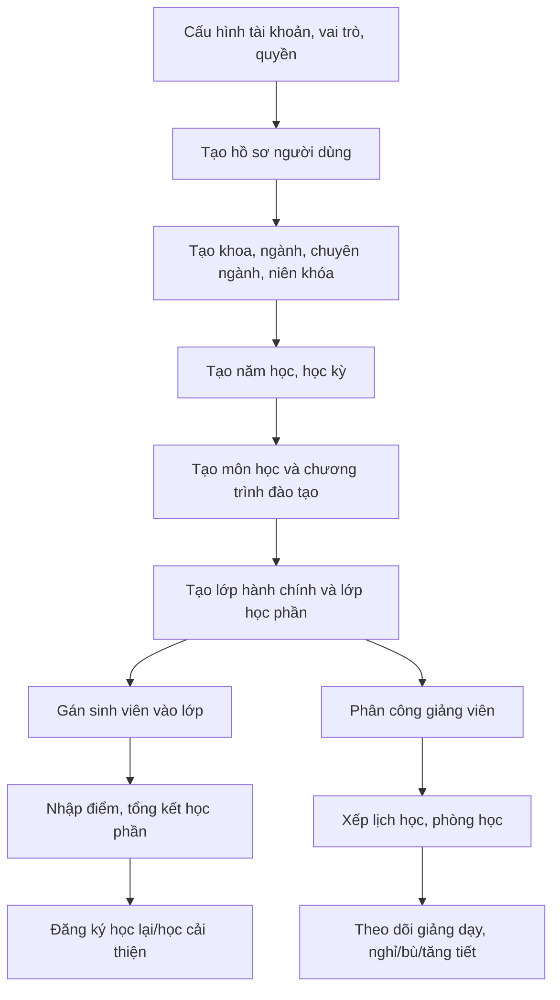
```mermaid
flowchart TD
    A["Cấu hình tài khoản, vai trò, quyền"] --> B["Tạo hồ sơ người dùng"]
    B --> C["Tạo khoa, ngành, chuyên ngành, niên khóa"]
    C --> D["Tạo năm học, học kỳ"]
    D --> E["Tạo môn học và chương trình đào tạo"]
    E --> F["Tạo lớp hành chính và lớp học phần"]
    F --> G["Gán sinh viên vào lớp"]
    F --> H["Phân công giảng viên"]
    H --> I["Xếp lịch học, phòng học"]
    I --> J["Theo dõi giảng dạy, nghỉ/bù/tăng tiết"]
    G --> K["Nhập điểm, tổng kết học phần"]
    K --> L["Đăng ký học lại/học cải thiện"]
```

## 2.2. Xác định tác nhân và chức năng

### 2.2.1. Tác nhân của hệ thống

| Tác nhân | Mô tả | Nhóm chức năng chính |
|---|---|---|
| Admin | Người quản trị hệ thống | Quản lý toàn bộ dữ liệu, tài khoản, quyền, cấu hình đào tạo, lịch, điểm |
| Nhân viên phòng đào tạo | Người thực hiện nghiệp vụ đào tạo | Tạo lớp, mở lớp học phần, gán sinh viên, phân công giảng dạy, duyệt điều chỉnh lịch |
| Giảng viên | Người phụ trách giảng dạy | Xem lịch dạy, xem lớp được phân công, nhập điểm, gửi yêu cầu nghỉ/bù/tăng tiết |
| Sinh viên | Người học | Xem hồ sơ, lịch học, kết quả học tập, đăng ký học lại/học cải thiện |
| Hệ thống email | Tác nhân ngoài | Gửi xác nhận tài khoản, link đổi mật khẩu, thông báo |

### 2.2.2. Chức năng tổng quan theo module

| Module | Chức năng chính | Module liên kết |
|---|---|---|
| Account/RBAC | Đăng nhập, đổi mật khẩu, vai trò, quyền, menu | Person/User, Student, Instructor, Staff |
| Person/User | Hồ sơ cá nhân, tài khoản, tạo sinh viên/giảng viên/staff | Account/RBAC, Academic, HR |
| Academic Setup | Khoa, ngành, chuyên ngành, niên khóa, năm học, học kỳ | Student, Curriculum, Class |
| Curriculum/Course | Môn học, chương trình đào tạo, môn tiên quyết, môn tương đương | Academic, CourseClass, Registration |
| Class/Registration/Grade | Lớp hành chính, lớp học phần, đăng ký học phần, điểm | Student, Curriculum, Schedule |
| Teaching/Schedule | Phân công giảng dạy, lịch học, phòng học, điều chỉnh lịch | Instructor, CourseClass, Grade |

## 2.3. Module Account/RBAC

Module Account/RBAC quản lý xác thực, phiên đăng nhập, đổi mật khẩu, khóa/mở tài khoản, vai trò, quyền truy cập API và menu hiển thị theo quyền. Đây là module nền, được sử dụng bởi toàn bộ các module nghiệp vụ khác.

### 2.3.1. Use Case Diagram

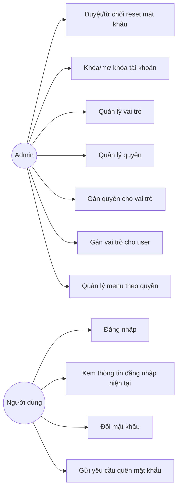
```mermaid
flowchart LR
    Admin((Admin))
    User((Người dùng))

    UC1["Đăng nhập"]
    UC2["Xem thông tin đăng nhập hiện tại"]
    UC3["Đổi mật khẩu"]
    UC4["Gửi yêu cầu quên mật khẩu"]
    UC5["Duyệt/từ chối reset mật khẩu"]
    UC6["Khóa/mở khóa tài khoản"]
    UC7["Quản lý vai trò"]
    UC8["Quản lý quyền"]
    UC9["Gán quyền cho vai trò"]
    UC10["Gán vai trò cho user"]
    UC11["Quản lý menu theo quyền"]

    User --> UC1
    User --> UC2
    User --> UC3
    User --> UC4
    Admin --> UC5
    Admin --> UC6
    Admin --> UC7
    Admin --> UC8
    Admin --> UC9
    Admin --> UC10
    Admin --> UC11
```

### 2.3.2. Sơ đồ hoạt động

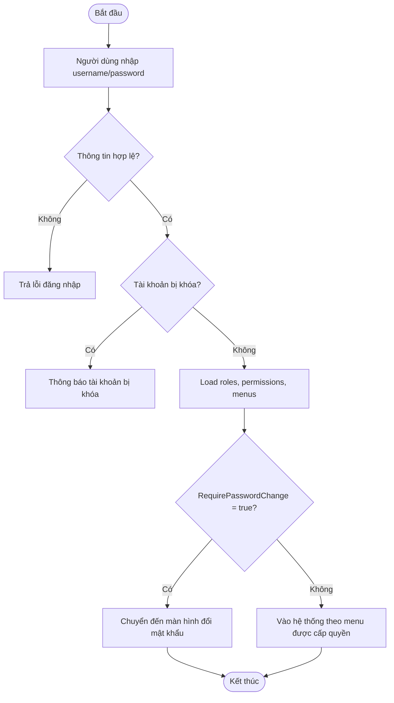
```mermaid
flowchart TD
    Start([Bắt đầu]) --> Login["Người dùng nhập username/password"]
    Login --> Check{"Thông tin hợp lệ?"}
    Check -- Không --> Error["Trả lỗi đăng nhập"]
    Check -- Có --> Locked{"Tài khoản bị khóa?"}
    Locked -- Có --> LockMsg["Thông báo tài khoản bị khóa"]
    Locked -- Không --> Role["Load roles, permissions, menus"]
    Role --> NeedChange{"RequirePasswordChange = true?"}
    NeedChange -- Có --> ChangePass["Chuyển đến màn hình đổi mật khẩu"]
    NeedChange -- Không --> Home["Vào hệ thống theo menu được cấp quyền"]
    ChangePass --> End([Kết thúc])
    Home --> End
```

### 2.3.3. Sơ đồ tuần tự

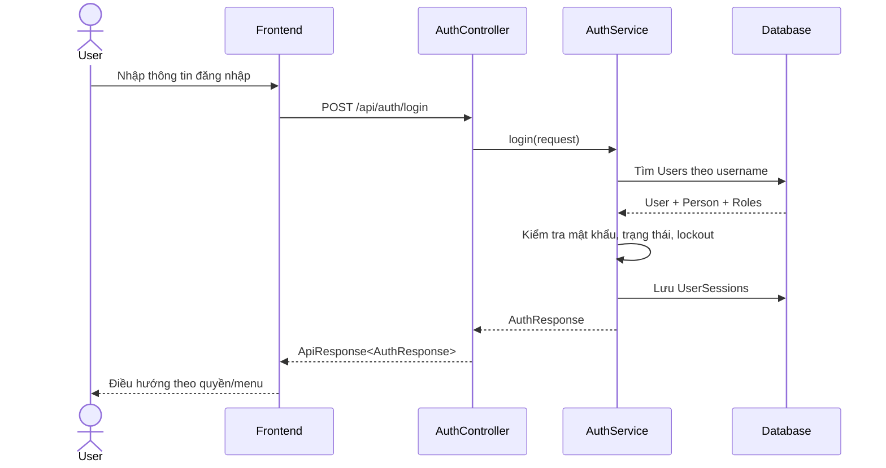
```mermaid
sequenceDiagram
    actor User
    participant FE as Frontend
    participant Auth as AuthController
    participant AuthService as AuthService
    participant DB as Database

    User->>FE: Nhập thông tin đăng nhập
    FE->>Auth: POST /api/auth/login
    Auth->>AuthService: login(request)
    AuthService->>DB: Tìm Users theo username
    DB-->>AuthService: User + Person + Roles
    AuthService->>AuthService: Kiểm tra mật khẩu, trạng thái, lockout
    AuthService->>DB: Lưu UserSessions
    AuthService-->>Auth: AuthResponse
    Auth-->>FE: ApiResponse<AuthResponse>
    FE-->>User: Điều hướng theo quyền/menu
```

### 2.3.4. Sơ đồ Class diagram

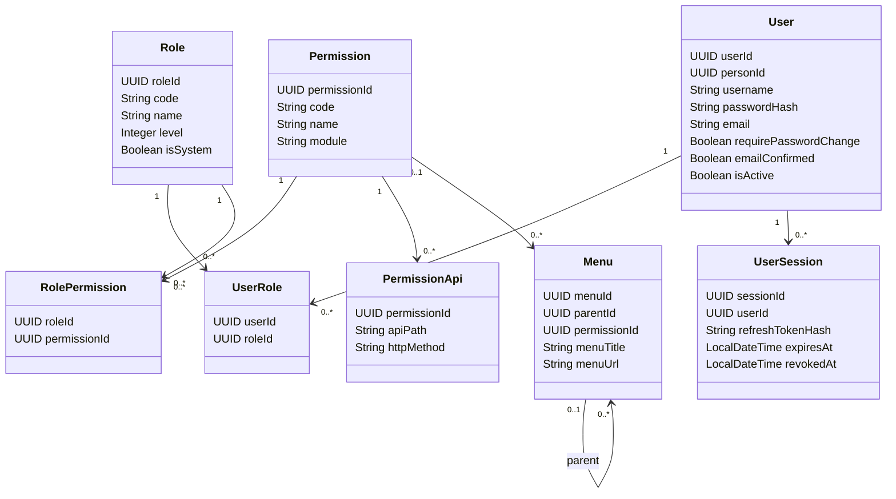
```mermaid
classDiagram
    class User {
        UUID userId
        UUID personId
        String username
        String passwordHash
        String email
        Boolean requirePasswordChange
        Boolean emailConfirmed
        Boolean isActive
    }

    class Role {
        UUID roleId
        String code
        String name
        Integer level
        Boolean isSystem
    }

    class Permission {
        UUID permissionId
        String code
        String name
        String module
    }

    class Menu {
        UUID menuId
        UUID parentId
        UUID permissionId
        String menuTitle
        String menuUrl
    }

    class UserRole {
        UUID userId
        UUID roleId
    }

    class RolePermission {
        UUID roleId
        UUID permissionId
    }

    class PermissionApi {
        UUID permissionId
        String apiPath
        String httpMethod
    }

    class UserSession {
        UUID sessionId
        UUID userId
        String refreshTokenHash
        LocalDateTime expiresAt
        LocalDateTime revokedAt
    }

    User "1" --> "0..*" UserRole
    Role "1" --> "0..*" UserRole
    Role "1" --> "0..*" RolePermission
    Permission "1" --> "0..*" RolePermission
    Permission "1" --> "0..*" PermissionApi
    Permission "0..1" --> "0..*" Menu
    Menu "0..1" --> "0..*" Menu : parent
    User "1" --> "0..*" UserSession
```

### 2.3.5. Thiết kế cơ sở dữ liệu

Các bảng chính của module gồm `Users`, `Roles`, `Permissions`, `Menus`, `UserRoles`, `RolePermissions`, `PermissionApis`, `UserSessions`, `PasswordResetRequests`.

```dbml
Table Users {
  UserId uuid [pk]
  PersonId uuid [not null, unique]
  Username varchar [not null, unique]
  PasswordHash varchar [not null]
  Email varchar [unique]
  RequirePasswordChange boolean
  EmailConfirmed boolean
  ConfirmationToken varchar
  LockoutEndAt timestamp
  IsActive boolean
}

Table Roles {
  RoleId uuid [pk]
  Code varchar [not null, unique]
  Name varchar [not null]
  Level int
  IsSystem boolean
  IsActive boolean
}

Table Permissions {
  PermissionId uuid [pk]
  Code varchar [not null, unique]
  Name varchar [not null]
  Module varchar
  IsActive boolean
}

Table Menus {
  MenuId uuid [pk]
  ParentId uuid
  PermissionId uuid
  MenuTitle varchar
  MenuUrl varchar
  MenuIcon varchar
  OrderIndex int
  IsActive boolean
}

Table UserRoles {
  UserId uuid [pk]
  RoleId uuid [pk]
  IsActive boolean
}

Table RolePermissions {
  RoleId uuid [pk]
  PermissionId uuid [pk]
  IsActive boolean
}

Table PermissionApis {
  PermissionId uuid [pk]
  ApiPath varchar [pk]
  HttpMethod varchar [pk]
  IsActive boolean
}

Table UserSessions {
  SessionId uuid [pk]
  UserId uuid [not null]
  RefreshTokenHash varchar
  ExpiresAt timestamp
  RevokedAt timestamp
}

Ref: UserRoles.UserId > Users.UserId
Ref: UserRoles.RoleId > Roles.RoleId
Ref: RolePermissions.RoleId > Roles.RoleId
Ref: RolePermissions.PermissionId > Permissions.PermissionId
Ref: PermissionApis.PermissionId > Permissions.PermissionId
Ref: Menus.PermissionId > Permissions.PermissionId
Ref: Menus.ParentId > Menus.MenuId
Ref: UserSessions.UserId > Users.UserId
```

## 2.4. Module Person/User và tạo đối tượng Student - Instructor - Staff

Module này quản lý dữ liệu hồ sơ người dùng và luồng admin tạo các đối tượng chính trong hệ thống. `Persons` lưu thông tin cá nhân dùng chung. `Students`, `Employees`, `Instructors`, `Staffs` lưu thông tin nghiệp vụ riêng. Khi admin tạo sinh viên, giảng viên hoặc nhân viên, hệ thống tự sinh tài khoản trong `Users` và gán role tương ứng.

### 2.4.1. Use Case Diagram

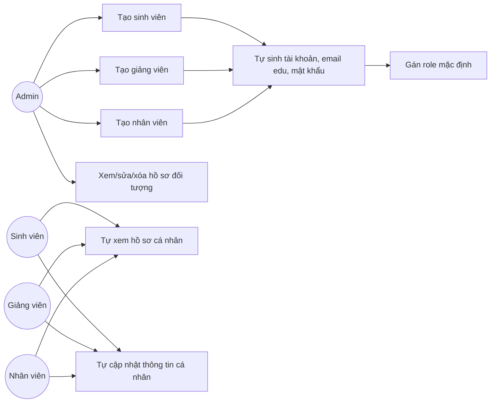
```mermaid
flowchart LR
    Admin((Admin))
    Student((Sinh viên))
    Instructor((Giảng viên))
    Staff((Nhân viên))

    UC1["Tạo sinh viên"]
    UC2["Tạo giảng viên"]
    UC3["Tạo nhân viên"]
    UC4["Xem/sửa/xóa hồ sơ đối tượng"]
    UC5["Tự xem hồ sơ cá nhân"]
    UC6["Tự cập nhật thông tin cá nhân"]
    UC7["Tự sinh tài khoản, email edu, mật khẩu"]
    UC8["Gán role mặc định"]

    Admin --> UC1
    Admin --> UC2
    Admin --> UC3
    Admin --> UC4
    UC1 --> UC7
    UC2 --> UC7
    UC3 --> UC7
    UC7 --> UC8

    Student --> UC5
    Student --> UC6
    Instructor --> UC5
    Instructor --> UC6
    Staff --> UC5
    Staff --> UC6
```

### 2.4.2. Sơ đồ hoạt động

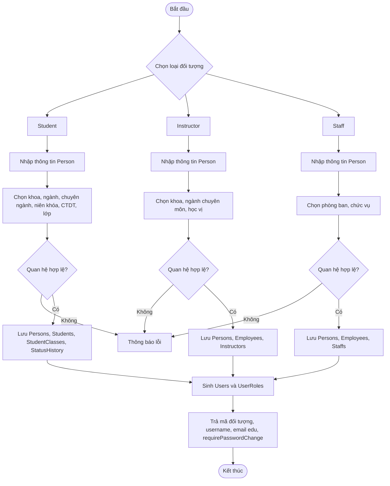
```mermaid
flowchart TD
    Start([Bắt đầu]) --> Type{"Chọn loại đối tượng"}
    Type --> S["Student"]
    Type --> I["Instructor"]
    Type --> F["Staff"]

    S --> SPerson["Nhập thông tin Person"]
    SPerson --> SRel["Chọn khoa, ngành, chuyên ngành, niên khóa, CTDT, lớp"]
    SRel --> SValidate{"Quan hệ hợp lệ?"}
    SValidate -- Không --> Error["Thông báo lỗi"]
    SValidate -- Có --> SaveStudent["Lưu Persons, Students, StudentClasses, StatusHistory"]

    I --> IPerson["Nhập thông tin Person"]
    IPerson --> IRel["Chọn khoa, ngành chuyên môn, học vị"]
    IRel --> IValidate{"Quan hệ hợp lệ?"}
    IValidate -- Không --> Error
    IValidate -- Có --> SaveInstructor["Lưu Persons, Employees, Instructors"]

    F --> FPerson["Nhập thông tin Person"]
    FPerson --> FRel["Chọn phòng ban, chức vụ"]
    FRel --> FValidate{"Quan hệ hợp lệ?"}
    FValidate -- Không --> Error
    FValidate -- Có --> SaveStaff["Lưu Persons, Employees, Staffs"]

    SaveStudent --> Account["Sinh Users và UserRoles"]
    SaveInstructor --> Account
    SaveStaff --> Account
    Account --> Response["Trả mã đối tượng, username, email edu, requirePasswordChange"]
    Response --> End([Kết thúc])
```

### 2.4.3. Sơ đồ tuần tự

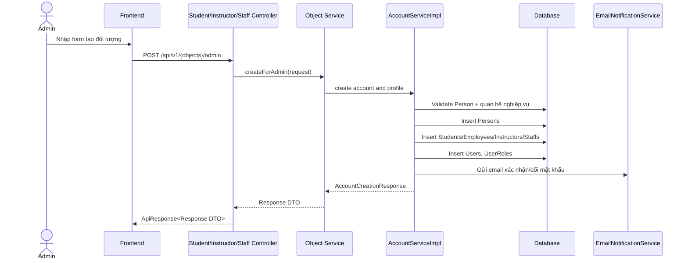
```mermaid
sequenceDiagram
    actor Admin
    participant FE as Frontend
    participant Controller as Student/Instructor/Staff Controller
    participant Service as Object Service
    participant Account as AccountServiceImpl
    participant DB as Database
    participant Mail as EmailNotificationService

    Admin->>FE: Nhập form tạo đối tượng
    FE->>Controller: POST /api/v1/{objects}/admin
    Controller->>Service: createForAdmin(request)
    Service->>Account: create account and profile
    Account->>DB: Validate Person + quan hệ nghiệp vụ
    Account->>DB: Insert Persons
    Account->>DB: Insert Students/Employees/Instructors/Staffs
    Account->>DB: Insert Users, UserRoles
    Account->>Mail: Gửi email xác nhận/đổi mật khẩu
    Account-->>Service: AccountCreationResponse
    Service-->>Controller: Response DTO
    Controller-->>FE: ApiResponse<Response DTO>
```

### 2.4.4. Sơ đồ Class diagram

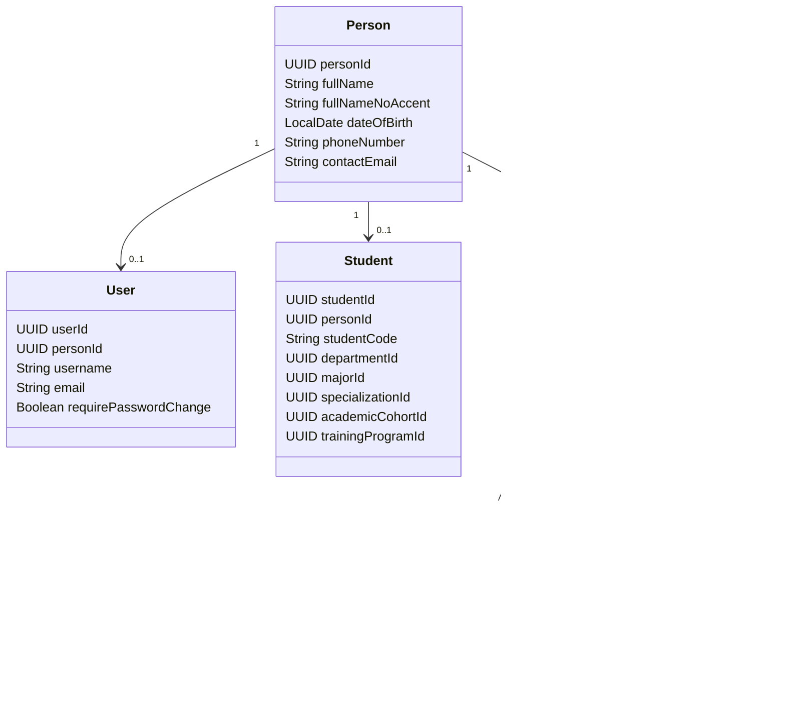
```mermaid
classDiagram
    class Person {
        UUID personId
        String fullName
        String fullNameNoAccent
        LocalDate dateOfBirth
        String phoneNumber
        String contactEmail
    }

    class User {
        UUID userId
        UUID personId
        String username
        String email
        Boolean requirePasswordChange
    }

    class Student {
        UUID studentId
        UUID personId
        String studentCode
        UUID departmentId
        UUID majorId
        UUID specializationId
        UUID academicCohortId
        UUID trainingProgramId
    }

    class Employee {
        UUID employeeId
        UUID personId
        String employeeCode
        String employeeType
        LocalDate startWorkDate
    }

    class InstructorProfile {
        UUID employeeId
        String instructorCode
        UUID departmentId
        UUID degreeId
        UUID majorId
    }

    class Staff {
        UUID employeeId
        String staffCode
        UUID divisionId
        UUID positionId
    }

    Person "1" --> "0..1" User
    Person "1" --> "0..1" Student
    Person "1" --> "0..1" Employee
    Employee "1" --> "0..1" InstructorProfile
    Employee "1" --> "0..1" Staff
```

### 2.4.5. Thiết kế cơ sở dữ liệu

```dbml
Table Persons {
  PersonId uuid [pk]
  FullName varchar [not null]
  FullNameNoAccent varchar
  Gender varchar
  DateOfBirth date
  ContactEmail varchar
  PhoneNumber varchar
  PersonalIdentificationNumber varchar
  IsActive boolean
}

Table Users {
  UserId uuid [pk]
  PersonId uuid [not null, unique]
  Username varchar [not null, unique]
  PasswordHash varchar [not null]
  Email varchar [unique]
  RequirePasswordChange boolean
  EmailConfirmed boolean
  ConfirmationToken varchar
  IsActive boolean
}

Table Students {
  StudentId uuid [pk]
  PersonId uuid [not null, unique]
  StudentCode varchar [not null, unique]
  DepartmentId uuid
  MajorId uuid
  SpecializationId uuid
  AcademicCohortId uuid
  TrainingProgramId uuid
  AdmissionDate date
  IsActive boolean
}

Table Employees {
  EmployeeId uuid [pk]
  PersonId uuid [not null, unique]
  EmployeeCode varchar [not null, unique]
  EmployeeType varchar
  StartWorkDate date
  EndWorkDate date
  ContractType varchar
  Status varchar
  IsActive boolean
}

Table Instructors {
  EmployeeId uuid [pk]
  InstructorCode varchar [not null, unique]
  DepartmentId uuid
  DegreeId uuid
  MajorId uuid
  AcademicRank varchar
  Specialization varchar
  Institution varchar
  GraduationYear int
  IsActive boolean
}

Table Staffs {
  EmployeeId uuid [pk]
  StaffCode varchar [not null, unique]
  DivisionId uuid
  PositionId uuid
  IsActive boolean
}

Ref: Users.PersonId > Persons.PersonId
Ref: Students.PersonId > Persons.PersonId
Ref: Employees.PersonId > Persons.PersonId
Ref: Instructors.EmployeeId > Employees.EmployeeId
Ref: Staffs.EmployeeId > Employees.EmployeeId
```

## 2.5. Module Academic Setup

Module Academic Setup quản lý dữ liệu nền của đào tạo, bao gồm khoa, ngành, chuyên ngành, niên khóa, năm học, học kỳ và lớp hành chính. Đây là cơ sở để tạo sinh viên, thiết kế chương trình đào tạo và mở lớp học phần.

### 2.5.1. Use Case Diagram

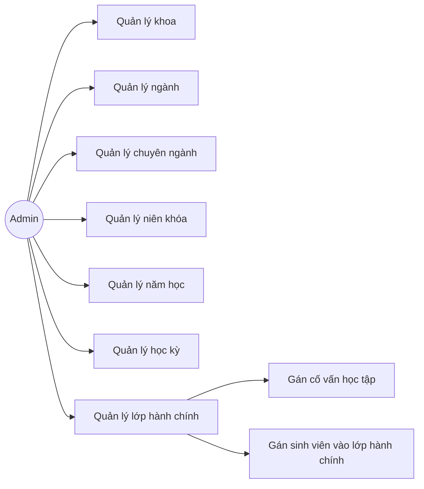
```mermaid
flowchart LR
    Admin((Admin))
    UC1["Quản lý khoa"]
    UC2["Quản lý ngành"]
    UC3["Quản lý chuyên ngành"]
    UC4["Quản lý niên khóa"]
    UC5["Quản lý năm học"]
    UC6["Quản lý học kỳ"]
    UC7["Quản lý lớp hành chính"]
    UC8["Gán cố vấn học tập"]
    UC9["Gán sinh viên vào lớp hành chính"]

    Admin --> UC1
    Admin --> UC2
    Admin --> UC3
    Admin --> UC4
    Admin --> UC5
    Admin --> UC6
    Admin --> UC7
    UC7 --> UC8
    UC7 --> UC9
```

### 2.5.2. Sơ đồ hoạt động

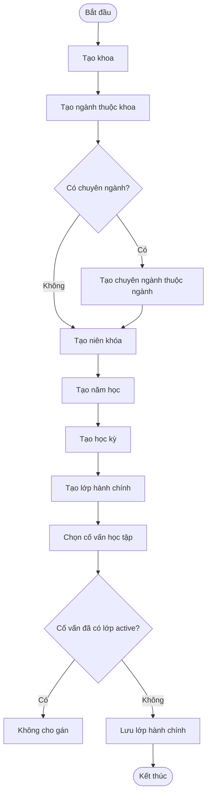
```mermaid
flowchart TD
    Start([Bắt đầu]) --> Dept["Tạo khoa"]
    Dept --> Major["Tạo ngành thuộc khoa"]
    Major --> Spec{"Có chuyên ngành?"}
    Spec -- Có --> CreateSpec["Tạo chuyên ngành thuộc ngành"]
    Spec -- Không --> Cohort["Tạo niên khóa"]
    CreateSpec --> Cohort
    Cohort --> SchoolYear["Tạo năm học"]
    SchoolYear --> Semester["Tạo học kỳ"]
    Semester --> Class["Tạo lớp hành chính"]
    Class --> Advisor["Chọn cố vấn học tập"]
    Advisor --> Validate{"Cố vấn đã có lớp active?"}
    Validate -- Có --> Error["Không cho gán"]
    Validate -- Không --> Save["Lưu lớp hành chính"]
    Save --> End([Kết thúc])
```

### 2.5.3. Sơ đồ tuần tự

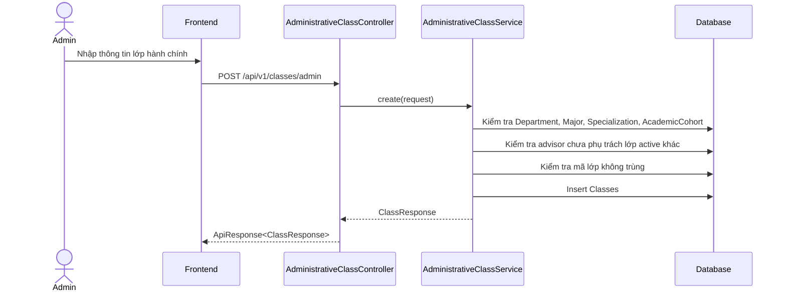
```mermaid
sequenceDiagram
    actor Admin
    participant FE as Frontend
    participant C as AdministrativeClassController
    participant S as AdministrativeClassService
    participant DB as Database

    Admin->>FE: Nhập thông tin lớp hành chính
    FE->>C: POST /api/v1/classes/admin
    C->>S: create(request)
    S->>DB: Kiểm tra Department, Major, Specialization, AcademicCohort
    S->>DB: Kiểm tra advisor chưa phụ trách lớp active khác
    S->>DB: Kiểm tra mã lớp không trùng
    S->>DB: Insert Classes
    S-->>C: ClassResponse
    C-->>FE: ApiResponse<ClassResponse>
```

### 2.5.4. Sơ đồ Class diagram

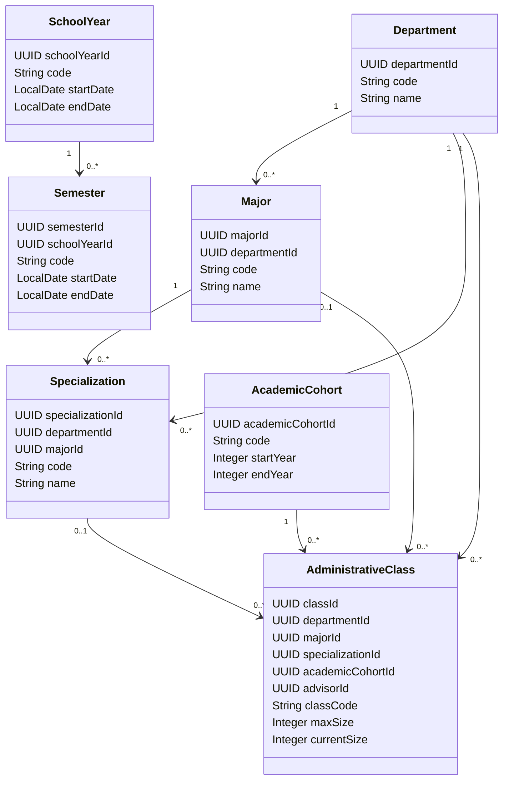
```mermaid
classDiagram
    class Department {
        UUID departmentId
        String code
        String name
    }
    class Major {
        UUID majorId
        UUID departmentId
        String code
        String name
    }
    class Specialization {
        UUID specializationId
        UUID departmentId
        UUID majorId
        String code
        String name
    }
    class AcademicCohort {
        UUID academicCohortId
        String code
        Integer startYear
        Integer endYear
    }
    class SchoolYear {
        UUID schoolYearId
        String code
        LocalDate startDate
        LocalDate endDate
    }
    class Semester {
        UUID semesterId
        UUID schoolYearId
        String code
        LocalDate startDate
        LocalDate endDate
    }
    class AdministrativeClass {
        UUID classId
        UUID departmentId
        UUID majorId
        UUID specializationId
        UUID academicCohortId
        UUID advisorId
        String classCode
        Integer maxSize
        Integer currentSize
    }

    Department "1" --> "0..*" Major
    Department "1" --> "0..*" Specialization
    Major "1" --> "0..*" Specialization
    SchoolYear "1" --> "0..*" Semester
    Department "1" --> "0..*" AdministrativeClass
    AcademicCohort "1" --> "0..*" AdministrativeClass
    Major "0..1" --> "0..*" AdministrativeClass
    Specialization "0..1" --> "0..*" AdministrativeClass
```

### 2.5.5. Thiết kế cơ sở dữ liệu

```dbml
Table Departments {
  DepartmentId uuid [pk]
  Code varchar [not null, unique]
  Name varchar [not null]
  Description varchar
  EstablishedDate date
  IsActive boolean
}

Table Majors {
  MajorId uuid [pk]
  DepartmentId uuid [not null]
  Code varchar [not null, unique]
  Name varchar [not null]
  EffectiveDate date
  ExpiryDate date
  IsActive boolean
}

Table Specializations {
  SpecializationId uuid [pk]
  DepartmentId uuid [not null]
  MajorId uuid [not null]
  Code varchar [not null]
  Name varchar [not null]
  IsActive boolean
}

Table AcademicCohorts {
  AcademicCohortId uuid [pk]
  Code varchar [not null, unique]
  Name varchar
  StartYear int
  EndYear int
  StartDate date
  EndDate date
  IsActive boolean
}

Table SchoolYears {
  SchoolYearId uuid [pk]
  Code varchar [not null, unique]
  Name varchar
  StartDate date
  EndDate date
  IsActive boolean
}

Table Semesters {
  SemesterId uuid [pk]
  SchoolYearId uuid [not null]
  Code varchar [not null]
  Name varchar [not null]
  StartDate date
  EndDate date
  Status boolean
  IsActive boolean
}

Table Classes {
  ClassId uuid [pk]
  DepartmentId uuid [not null]
  MajorId uuid
  SpecializationId uuid
  AcademicCohortId uuid [not null]
  AdvisorId uuid
  ClassCode varchar [not null, unique]
  ClassName varchar
  ClassPhase varchar
  MaxSize int
  CurrentSize int
  IsActive boolean
}

Ref: Majors.DepartmentId > Departments.DepartmentId
Ref: Specializations.DepartmentId > Departments.DepartmentId
Ref: Specializations.MajorId > Majors.MajorId
Ref: Semesters.SchoolYearId > SchoolYears.SchoolYearId
Ref: Classes.DepartmentId > Departments.DepartmentId
Ref: Classes.MajorId > Majors.MajorId
Ref: Classes.SpecializationId > Specializations.SpecializationId
Ref: Classes.AcademicCohortId > AcademicCohorts.AcademicCohortId
```

## 2.6. Module Curriculum/Course

Module Curriculum/Course quản lý môn học, chương trình đào tạo, môn thuộc chương trình đào tạo, môn tiên quyết, môn học song hành và môn tương đương. Module này quyết định sinh viên phải học những học phần nào theo từng giai đoạn: cơ sở chung hoặc chuyên sâu.

### 2.6.1. Use Case Diagram

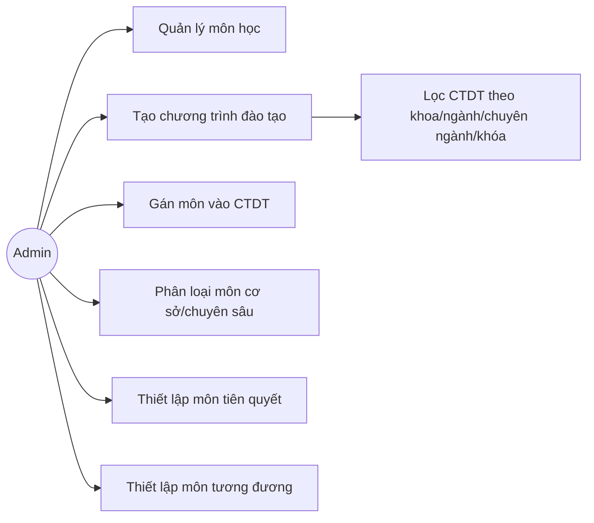
```mermaid
flowchart LR
    Admin((Admin))
    UC1["Quản lý môn học"]
    UC2["Tạo chương trình đào tạo"]
    UC3["Gán môn vào CTDT"]
    UC4["Phân loại môn cơ sở/chuyên sâu"]
    UC5["Thiết lập môn tiên quyết"]
    UC6["Thiết lập môn tương đương"]
    UC7["Lọc CTDT theo khoa/ngành/chuyên ngành/khóa"]

    Admin --> UC1
    Admin --> UC2
    Admin --> UC3
    Admin --> UC4
    Admin --> UC5
    Admin --> UC6
    UC2 --> UC7
```

### 2.6.2. Sơ đồ hoạt động

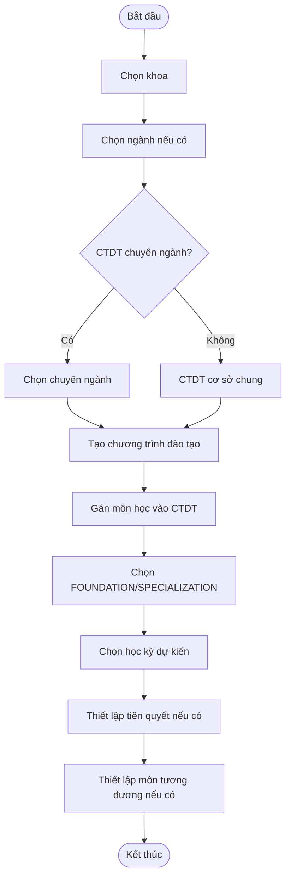
```mermaid
flowchart TD
    Start([Bắt đầu]) --> SelectDept["Chọn khoa"]
    SelectDept --> SelectMajor["Chọn ngành nếu có"]
    SelectMajor --> SelectSpec{"CTDT chuyên ngành?"}
    SelectSpec -- Có --> Spec["Chọn chuyên ngành"]
    SelectSpec -- Không --> Foundation["CTDT cơ sở chung"]
    Spec --> CreateProgram["Tạo chương trình đào tạo"]
    Foundation --> CreateProgram
    CreateProgram --> AddCourse["Gán môn học vào CTDT"]
    AddCourse --> Phase["Chọn FOUNDATION/SPECIALIZATION"]
    Phase --> Semester["Chọn học kỳ dự kiến"]
    Semester --> Prereq["Thiết lập tiên quyết nếu có"]
    Prereq --> Equivalent["Thiết lập môn tương đương nếu có"]
    Equivalent --> End([Kết thúc])
```

### 2.6.3. Sơ đồ tuần tự

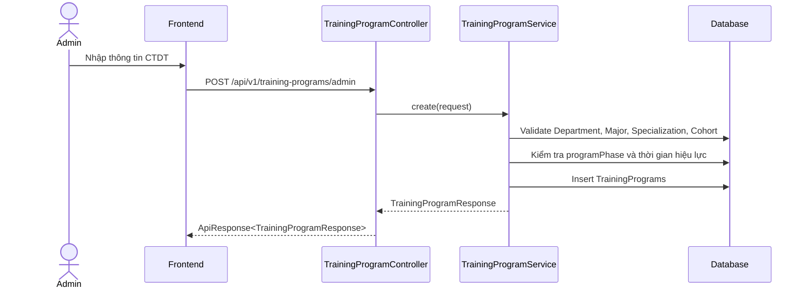
```mermaid
sequenceDiagram
    actor Admin
    participant FE as Frontend
    participant C as TrainingProgramController
    participant S as TrainingProgramService
    participant DB as Database

    Admin->>FE: Nhập thông tin CTDT
    FE->>C: POST /api/v1/training-programs/admin
    C->>S: create(request)
    S->>DB: Validate Department, Major, Specialization, Cohort
    S->>DB: Kiểm tra programPhase và thời gian hiệu lực
    S->>DB: Insert TrainingPrograms
    S-->>C: TrainingProgramResponse
    C-->>FE: ApiResponse<TrainingProgramResponse>
```

### 2.6.4. Sơ đồ Class diagram

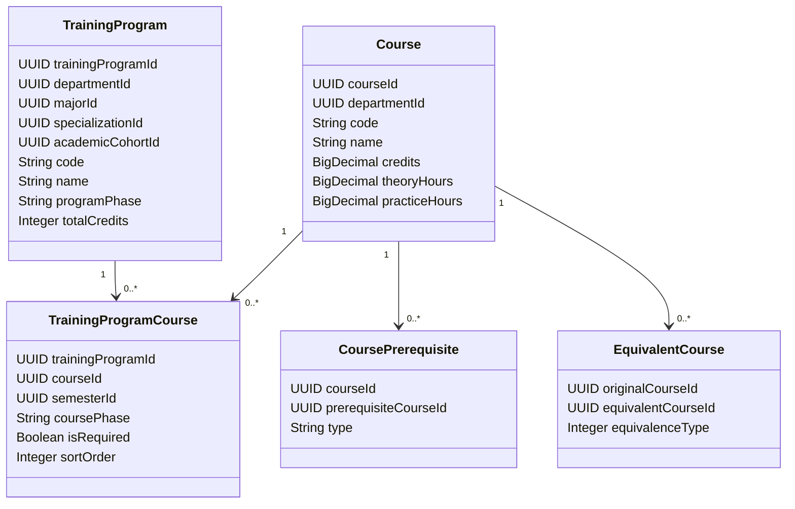
```mermaid
classDiagram
    class TrainingProgram {
        UUID trainingProgramId
        UUID departmentId
        UUID majorId
        UUID specializationId
        UUID academicCohortId
        String code
        String name
        String programPhase
        Integer totalCredits
    }

    class Course {
        UUID courseId
        UUID departmentId
        String code
        String name
        BigDecimal credits
        BigDecimal theoryHours
        BigDecimal practiceHours
    }

    class TrainingProgramCourse {
        UUID trainingProgramId
        UUID courseId
        UUID semesterId
        String coursePhase
        Boolean isRequired
        Integer sortOrder
    }

    class CoursePrerequisite {
        UUID courseId
        UUID prerequisiteCourseId
        String type
    }

    class EquivalentCourse {
        UUID originalCourseId
        UUID equivalentCourseId
        Integer equivalenceType
    }

    TrainingProgram "1" --> "0..*" TrainingProgramCourse
    Course "1" --> "0..*" TrainingProgramCourse
    Course "1" --> "0..*" CoursePrerequisite
    Course "1" --> "0..*" EquivalentCourse
```

### 2.6.5. Thiết kế cơ sở dữ liệu

```dbml
Table TrainingPrograms {
  TrainingProgramId uuid [pk]
  DepartmentId uuid [not null]
  MajorId uuid
  SpecializationId uuid
  AcademicCohortId uuid [not null]
  Code varchar [not null, unique]
  Name varchar [not null]
  ProgramPhase varchar
  TotalCredits int
  DurationYears decimal
  MaxDurationYears decimal
  EffectiveDate date
  ExpiryDate date
  IsActive boolean
}

Table Courses {
  CourseId uuid [pk]
  DepartmentId uuid
  Code varchar [not null, unique]
  Name varchar [not null]
  CourseType varchar
  Credits decimal [not null]
  TheoryHours decimal
  PracticeHours decimal
  SelfStudyHours decimal
  IsActive boolean
}

Table TrainingProgramCourses {
  TrainingProgramId uuid [pk]
  CourseId uuid [pk]
  SemesterId uuid
  CoursePhase varchar
  IsRequired boolean
  PrerequisiteCourseId uuid
  IsPrerequisiteRequired boolean
  SortOrder int
  Status varchar
  IsActive boolean
}

Table CoursePrerequisites {
  CourseId uuid [pk]
  PrerequisiteCourseId uuid [pk]
  Type varchar
  IsActive boolean
}

Table EquivalentCourses {
  EquivalentCoursesId uuid [pk]
  OriginalCourseId uuid [not null]
  EquivalentCourseId uuid [not null]
  EquivalenceType int
  EffectDate date
  IsActive boolean
}

Ref: TrainingProgramCourses.TrainingProgramId > TrainingPrograms.TrainingProgramId
Ref: TrainingProgramCourses.CourseId > Courses.CourseId
Ref: TrainingProgramCourses.PrerequisiteCourseId > Courses.CourseId
Ref: CoursePrerequisites.CourseId > Courses.CourseId
Ref: CoursePrerequisites.PrerequisiteCourseId > Courses.CourseId
Ref: EquivalentCourses.OriginalCourseId > Courses.CourseId
Ref: EquivalentCourses.EquivalentCourseId > Courses.CourseId
```

## 2.7. Module Class/Registration/Grade

Module này quản lý lớp học phần, danh sách sinh viên trong lớp học phần, đợt đăng ký, đăng ký học lại/học cải thiện và kết quả học tập. Đây là module nối giữa chương trình đào tạo, sinh viên, lịch học và điểm.

### 2.7.1. Use Case Diagram

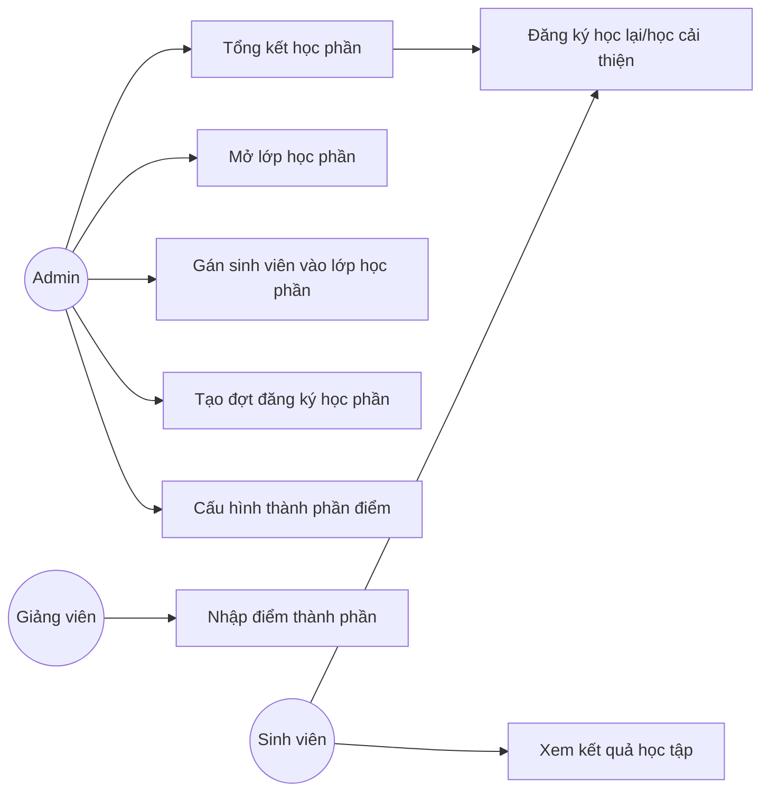
```mermaid
flowchart LR
    Admin((Admin))
    Student((Sinh viên))
    Instructor((Giảng viên))

    UC1["Mở lớp học phần"]
    UC2["Gán sinh viên vào lớp học phần"]
    UC3["Tạo đợt đăng ký học phần"]
    UC4["Đăng ký học lại/học cải thiện"]
    UC5["Cấu hình thành phần điểm"]
    UC6["Nhập điểm thành phần"]
    UC7["Tổng kết học phần"]
    UC8["Xem kết quả học tập"]

    Admin --> UC1
    Admin --> UC2
    Admin --> UC3
    Admin --> UC5
    Admin --> UC7
    Student --> UC4
    Student --> UC8
    Instructor --> UC6
    UC7 --> UC4
```

### 2.7.2. Sơ đồ hoạt động

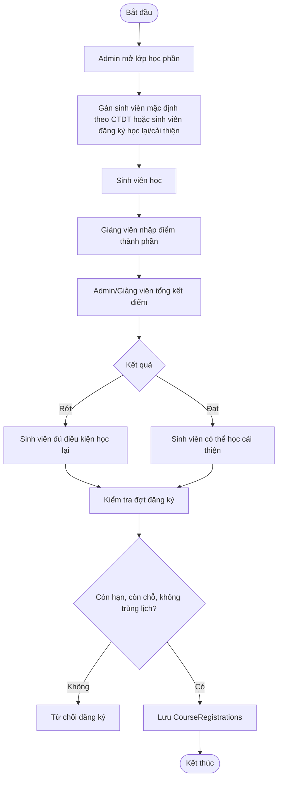
```mermaid
flowchart TD
    Start([Bắt đầu]) --> OpenClass["Admin mở lớp học phần"]
    OpenClass --> AddStudent["Gán sinh viên mặc định theo CTDT hoặc sinh viên đăng ký học lại/cải thiện"]
    AddStudent --> Study["Sinh viên học"]
    Study --> Grade["Giảng viên nhập điểm thành phần"]
    Grade --> Finalize["Admin/Giảng viên tổng kết điểm"]
    Finalize --> Result{"Kết quả"}
    Result -- Rớt --> Retake["Sinh viên đủ điều kiện học lại"]
    Result -- Đạt --> Improve["Sinh viên có thể học cải thiện"]
    Retake --> Period["Kiểm tra đợt đăng ký"]
    Improve --> Period
    Period --> Valid{"Còn hạn, còn chỗ, không trùng lịch?"}
    Valid -- Không --> Reject["Từ chối đăng ký"]
    Valid -- Có --> Register["Lưu CourseRegistrations"]
    Register --> End([Kết thúc])
```

### 2.7.3. Sơ đồ tuần tự

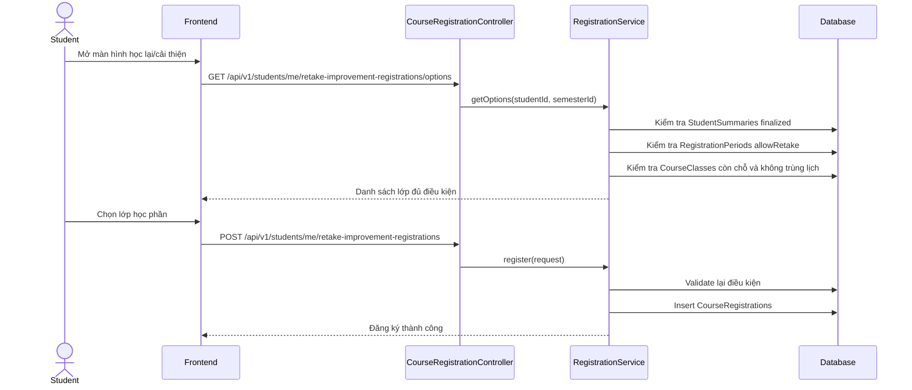
```mermaid
sequenceDiagram
    actor Student
    participant FE as Frontend
    participant C as CourseRegistrationController
    participant S as RegistrationService
    participant DB as Database

    Student->>FE: Mở màn hình học lại/cải thiện
    FE->>C: GET /api/v1/students/me/retake-improvement-registrations/options
    C->>S: getOptions(studentId, semesterId)
    S->>DB: Kiểm tra StudentSummaries finalized
    S->>DB: Kiểm tra RegistrationPeriods allowRetake
    S->>DB: Kiểm tra CourseClasses còn chỗ và không trùng lịch
    S-->>FE: Danh sách lớp đủ điều kiện
    Student->>FE: Chọn lớp học phần
    FE->>C: POST /api/v1/students/me/retake-improvement-registrations
    C->>S: register(request)
    S->>DB: Validate lại điều kiện
    S->>DB: Insert CourseRegistrations
    S-->>FE: Đăng ký thành công
```

### 2.7.4. Sơ đồ Class diagram

```mermaid
classDiagram
    class CourseClass {
        UUID courseClassId
        UUID courseId
        UUID semesterId
        String courseClassCode
        Integer maxStudent
        Integer currentStudent
        LocalDate startDate
        LocalDate endDate
    }

    class RegistrationPeriod {
        UUID registrationPeriodId
        UUID semesterId
        LocalDateTime startDate
        LocalDateTime endDate
        Boolean allowRetake
    }

    class CourseRegistration {
        UUID courseRegistrationId
        UUID studentId
        UUID courseClassId
        UUID registrationPeriodId
        Integer registrationType
        Integer status
    }

    class GradeComponent {
        UUID componentId
        UUID courseClassId
        String code
        BigDecimal weight
    }

    class StudentComponentGrade {
        UUID studentId
        UUID componentId
        UUID courseRegistrationId
        BigDecimal score
    }

    class StudentSummary {
        UUID studentSummaryId
        UUID studentId
        UUID courseRegistrationId
        BigDecimal totalScore
        String resultStatus
        Boolean isFinalized
    }

    CourseClass "1" --> "0..*" CourseRegistration
    RegistrationPeriod "1" --> "0..*" CourseRegistration
    CourseClass "1" --> "0..*" GradeComponent
    CourseRegistration "1" --> "0..*" StudentComponentGrade
    CourseRegistration "1" --> "0..1" StudentSummary
```

### 2.7.5. Thiết kế cơ sở dữ liệu

```dbml
Table CourseClasses {
  CourseClassId uuid [pk]
  CourseId uuid [not null]
  SemesterId uuid [not null]
  CourseClassCode varchar [not null]
  MaxStudent int
  CurrentStudent int
  StartDate date
  EndDate date
  Status varchar
  IsActive boolean
}

Table RegistrationPeriods {
  RegistrationPeriodId uuid [pk]
  SemesterId uuid [not null]
  Code varchar [not null, unique]
  Name varchar [not null]
  StartDate timestamp
  EndDate timestamp
  MinCredits int
  MaxCredits int
  AllowRetake boolean
  Status int
  IsActive boolean
}

Table CourseRegistrations {
  CourseRegistrationId uuid [pk]
  StudentId uuid [not null]
  CourseClassId uuid [not null]
  RegistrationPeriodId uuid [not null]
  RegistrationType int
  RegisteredAt timestamp
  Status int
  IsPaid boolean
  IsActive boolean
}

Table GradeComponents {
  ComponentId uuid [pk]
  CourseClassId uuid [not null]
  Code varchar
  Name varchar
  Weight decimal
  MaxScore decimal
  IsActive boolean
}

Table StudentComponentGrades {
  StudentId uuid [pk]
  ComponentId uuid [pk]
  CourseRegistrationId uuid
  Score decimal
  Note varchar
  IsActive boolean
}

Table StudentSummaries {
  StudentSummaryId uuid [pk]
  StudentId uuid [not null]
  CourseRegistrationId uuid [not null]
  TotalScore decimal
  LetterGrade varchar
  ResultStatus varchar
  IsFinalized boolean
}

Ref: CourseRegistrations.CourseClassId > CourseClasses.CourseClassId
Ref: CourseRegistrations.RegistrationPeriodId > RegistrationPeriods.RegistrationPeriodId
Ref: GradeComponents.CourseClassId > CourseClasses.CourseClassId
Ref: StudentComponentGrades.ComponentId > GradeComponents.ComponentId
Ref: StudentComponentGrades.CourseRegistrationId > CourseRegistrations.CourseRegistrationId
Ref: StudentSummaries.CourseRegistrationId > CourseRegistrations.CourseRegistrationId
```

## 2.8. Module Teaching/Schedule

Module Teaching/Schedule quản lý phân công giảng dạy, lịch học cố định, phòng học, tiết học, theo dõi tiến độ giảng dạy và xử lý yêu cầu nghỉ/bù/tăng tiết. Thiết kế hiện tại giữ `Schedules` là lịch gốc, còn các thay đổi phát sinh được lưu bằng `ScheduleAdjustmentRequests` và `TeachingSessionOverrides`.

### 2.8.1. Use Case Diagram

```mermaid
flowchart LR
    Admin((Admin))
    Instructor((Giảng viên))
    System((Hệ thống))

    UC1["Phân công giảng dạy"]
    UC2["Tạo lịch học cố định"]
    UC3["Kiểm tra trùng giảng viên/phòng/lớp"]
    UC4["Xem lịch dạy"]
    UC5["Gửi yêu cầu nghỉ/bù/tăng tiết"]
    UC6["Duyệt yêu cầu điều chỉnh"]
    UC7["Tạo lịch override"]
    UC8["Theo dõi tiến độ giảng dạy"]

    Admin --> UC1
    Admin --> UC2
    Admin --> UC6
    Instructor --> UC4
    Instructor --> UC5
    System --> UC3
    UC5 --> UC3
    UC6 --> UC7
    UC2 --> UC8
    UC7 --> UC8
```

### 2.8.2. Sơ đồ hoạt động

```mermaid
flowchart TD
    Start([Bắt đầu]) --> Assign["Admin phân công giảng viên cho lớp học phần"]
    Assign --> Schedule["Tạo lịch học cố định"]
    Schedule --> Check{"Trùng GV/phòng/lớp?"}
    Check -- Có --> Error["Chọn lại phòng hoặc tiết"]
    Check -- Không --> Save["Lưu Schedules"]
    Save --> Teach["Giảng viên giảng dạy theo lịch"]
    Teach --> Request{"Có nghỉ/bù/tăng tiết?"}
    Request -- Không --> Progress["Cập nhật tiến độ giảng dạy"]
    Request -- Có --> Submit["Giảng viên gửi ScheduleAdjustmentRequest"]
    Submit --> AutoCheck["Hệ thống kiểm tra tự động và gợi ý"]
    AutoCheck --> Review["Admin duyệt"]
    Review --> Approved{"Đồng ý?"}
    Approved -- Không --> Reject["Cập nhật trạng thái từ chối/trả lại"]
    Approved -- Có --> Override["Tạo TeachingSessionOverrides"]
    Override --> Progress
    Progress --> End([Kết thúc])
```

### 2.8.3. Sơ đồ tuần tự

```mermaid
sequenceDiagram
    actor Instructor
    actor Admin
    participant FE as Frontend
    participant C as ScheduleAdjustmentController
    participant S as ScheduleAdjustmentService
    participant DB as Database

    Instructor->>FE: Chọn lịch gốc và nhập ngày nghỉ/bù
    FE->>C: POST /api/v1/schedule-adjustments/validate
    C->>S: validate(request)
    S->>DB: Kiểm tra giảng viên rảnh
    S->>DB: Kiểm tra phòng rảnh
    S->>DB: Kiểm tra lớp không trùng lịch
    S->>DB: Kiểm tra ngày trong học kỳ
    S-->>FE: Kết quả kiểm tra và gợi ý
    Instructor->>FE: Gửi yêu cầu
    FE->>C: POST /api/v1/schedule-adjustments
    C->>S: create(request)
    S->>DB: Insert ScheduleAdjustmentRequests
    Admin->>FE: Duyệt yêu cầu
    FE->>C: POST /api/v1/admin/schedule-adjustments/{id}/approve
    C->>S: approve(id)
    S->>DB: Insert TeachingSessionOverrides
    S->>DB: Update request status APPROVED
```

### 2.8.4. Sơ đồ Class diagram

```mermaid
classDiagram
    class TeachingAssignment {
        UUID assignmentId
        UUID instructorId
        UUID courseClassId
        UUID classId
        UUID semesterId
        Boolean isActive
    }

    class Schedule {
        UUID scheduleId
        UUID courseClassId
        UUID employeeId
        UUID semesterId
        UUID roomId
        UUID timeSlotId
        Integer dayOfWeek
        Integer numberOfPeriods
    }

    class Room {
        UUID roomId
        UUID buildingId
        String code
        Integer capacity
    }

    class TimeSlot {
        UUID timeSlotId
        String slotCode
        LocalTime startTime
        LocalTime endTime
    }

    class ScheduleAdjustmentRequest {
        UUID requestId
        UUID originalScheduleId
        UUID requestedByInstructorId
        String requestType
        LocalDate proposedDate
        String status
    }

    class TeachingSessionOverride {
        UUID overrideId
        UUID requestId
        UUID originalScheduleId
        LocalDate sessionDate
        String overrideType
    }

    class TeachingProgressLog {
        UUID teachingProgressLogId
        UUID courseClassId
        UUID scheduleId
        UUID instructorId
        Integer numberOfPeriods
    }

    TeachingAssignment --> Schedule
    Schedule --> Room
    Schedule --> TimeSlot
    Schedule "1" --> "0..*" ScheduleAdjustmentRequest
    ScheduleAdjustmentRequest "1" --> "0..*" TeachingSessionOverride
    Schedule "1" --> "0..*" TeachingProgressLog
```

### 2.8.5. Thiết kế cơ sở dữ liệu

```dbml
Table TeachingAssignments {
  AssignmentId uuid [pk]
  InstructorId uuid [not null]
  CourseClassId uuid [not null]
  ClassId uuid [not null]
  SemesterId uuid [not null]
  Note varchar
  IsActive boolean
}

Table Rooms {
  RoomId uuid [pk]
  BuildingId uuid [not null]
  Code varchar [not null, unique]
  Name varchar
  Capacity int
  Type varchar
  Status varchar
  IsActive boolean
}

Table TimeSlots {
  TimeSlotId uuid [pk]
  SlotCode varchar [not null, unique]
  StartTime time
  EndTime time
  IsActive boolean
}

Table Schedules {
  ScheduleId uuid [pk]
  CourseClassId uuid [not null]
  EmployeeId uuid
  SemesterId uuid [not null]
  RoomId uuid [not null]
  TimeSlotId uuid [not null]
  DayOfWeek int
  Date date
  NumberOfPeriods int
  StartDate timestamp
  EndDate timestamp
  ScheduleStatus varchar
  IsOriginal boolean
  IsActive boolean
}

Table ScheduleAdjustmentRequests {
  RequestId uuid [pk]
  CourseClassId uuid [not null]
  OriginalScheduleId uuid
  RequestedByInstructorId uuid [not null]
  RequestType varchar
  AbsentDate date
  AbsentTimeSlotId uuid
  ProposedDate date
  ProposedTimeSlotId uuid
  ProposedRoomId uuid
  ProposedNumberOfPeriods int
  Reason varchar
  Status varchar
}

Table TeachingSessionOverrides {
  OverrideId uuid [pk]
  RequestId uuid [not null]
  CourseClassId uuid [not null]
  OriginalScheduleId uuid
  SessionDate date
  TimeSlotId uuid
  RoomId uuid
  InstructorId uuid
  OverrideType varchar
  NumberOfPeriods int
  Status varchar
}

Table TeachingProgressLogs {
  TeachingProgressLogId uuid [pk]
  CourseClassId uuid [not null]
  ScheduleId uuid
  InstructorId uuid
  TeachingDate date
  NumberOfPeriods int
  Status varchar
  Note varchar
}

Ref: Schedules.RoomId > Rooms.RoomId
Ref: Schedules.TimeSlotId > TimeSlots.TimeSlotId
Ref: ScheduleAdjustmentRequests.OriginalScheduleId > Schedules.ScheduleId
Ref: ScheduleAdjustmentRequests.ProposedTimeSlotId > TimeSlots.TimeSlotId
Ref: ScheduleAdjustmentRequests.ProposedRoomId > Rooms.RoomId
Ref: TeachingSessionOverrides.RequestId > ScheduleAdjustmentRequests.RequestId
Ref: TeachingSessionOverrides.OriginalScheduleId > Schedules.ScheduleId
Ref: TeachingSessionOverrides.TimeSlotId > TimeSlots.TimeSlotId
Ref: TeachingSessionOverrides.RoomId > Rooms.RoomId
Ref: TeachingProgressLogs.ScheduleId > Schedules.ScheduleId
```

## 2.9. Tổng hợp liên kết giữa các module

Sau khi tách theo module, có thể thấy mỗi module có phạm vi riêng nhưng vẫn liên kết qua các khóa nghiệp vụ chính:

| Module nguồn | Module đích | Liên kết |
|---|---|---|
| Account/RBAC | Person/User | `Users.PersonId`, `UserRoles.UserId` |
| Person/User | Academic Setup | `Students.DepartmentId`, `Students.MajorId`, `Students.AcademicCohortId` |
| Academic Setup | Curriculum/Course | `TrainingPrograms.DepartmentId`, `MajorId`, `SpecializationId`, `AcademicCohortId` |
| Curriculum/Course | Class/Registration/Grade | `CourseClasses.CourseId`, `TrainingProgramCourses.CourseId` |
| Class/Registration/Grade | Teaching/Schedule | `TeachingAssignments.CourseClassId`, `Schedules.CourseClassId` |
| Teaching/Schedule | Class/Registration/Grade | Lịch học được dùng để kiểm tra trùng khi sinh viên đăng ký học lại/cải thiện |
| Grade | Registration | `StudentSummaries` quyết định sinh viên được học lại hay học cải thiện |

Sơ đồ tổng hợp:

```mermaid
flowchart LR
    A["Account/RBAC"] --> B["Person/User"]
    B --> C["Student/Instructor/Staff"]
    C --> D["Academic Setup"]
    D --> E["Curriculum/Course"]
    E --> F["Class/Registration/Grade"]
    F --> G["Teaching/Schedule"]
    G --> F
    F --> H["Retake/Improvement"]
```

