# CHƯƠNG 3. XÂY DỰNG GIAO DIỆN VÀ TRIỂN KHAI CHỨC NĂNG HỆ THỐNG WEBSITE

## 3.1. Mục tiêu chương

Chương này trình bày quá trình xây dựng giao diện và triển khai các chức năng chính của hệ thống quản lý đào tạo đại học. Nếu chương 2 tập trung vào phân tích và thiết kế hệ thống, thì chương 3 tập trung vào việc hiện thực hóa các thiết kế đó thành các màn hình, luồng thao tác và chức năng có thể sử dụng trên website.

Các nội dung trong chương được trình bày theo từng module nghiệp vụ để đảm bảo tính rõ ràng và thống nhất với thiết kế ở chương 2. Với mỗi module, báo cáo mô tả mục tiêu chức năng, workflow xử lý, các màn hình cần có, dữ liệu đầu vào, kết quả đầu ra và vị trí chèn ảnh minh họa giao diện.

## 3.2. Môi trường và công nghệ triển khai

### 3.2.1. Công nghệ backend

Backend của hệ thống được xây dựng bằng Java Spring Boot. Các thành phần chính gồm:

| Thành phần | Công nghệ sử dụng | Vai trò |
|---|---|---|
| Ngôn ngữ lập trình | Java 17 | Xây dựng logic nghiệp vụ |
| Framework backend | Spring Boot | Xây dựng RESTful API |
| ORM | Spring Data JPA/Hibernate | Ánh xạ entity với cơ sở dữ liệu |
| Migration | Flyway | Quản lý thay đổi cấu trúc cơ sở dữ liệu |
| Cơ sở dữ liệu | PostgreSQL | Lưu trữ dữ liệu hệ thống |
| Mapping | MapStruct | Chuyển đổi Entity và DTO |
| Security | Spring Security/JWT | Xác thực và phân quyền |
| Test | JUnit, Spring Boot Test, Testcontainers | Kiểm thử logic nghiệp vụ |

### 3.2.2. Công nghệ frontend

Frontend của hệ thống được xây dựng dưới dạng website quản trị và website người dùng.

| Thành phần | Công nghệ sử dụng | Vai trò |
|---|---|---|
| Framework frontend | Next.js | Xây dựng giao diện website |
| Ngôn ngữ | TypeScript/JavaScript | Xử lý logic phía client |
| Styling | Tailwind CSS | Thiết kế giao diện |
| HTTP Client | Fetch/Axios | Gọi API backend |
| Routing | Next.js App Router | Điều hướng trang |
| State/UI | Component-based UI | Tổ chức màn hình theo module |

### 3.2.3. Mô hình giao tiếp frontend - backend

Frontend giao tiếp với backend thông qua RESTful API. Mỗi request từ giao diện được gửi đến backend để xử lý nghiệp vụ, kiểm tra dữ liệu, phân quyền và lưu trữ vào cơ sở dữ liệu. Dữ liệu trả về được chuẩn hóa bằng lớp `ApiResponse<T>`.

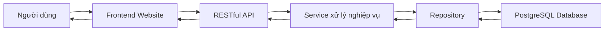

## 3.3. Kiến trúc triển khai chức năng website

Hệ thống website được tổ chức theo hướng module nghiệp vụ. Mỗi module có các màn hình danh sách, thêm mới, cập nhật, chi tiết, xóa hoặc khóa dữ liệu tùy theo chức năng. Các màn hình quản trị được bảo vệ bởi phân quyền RBAC, chỉ những người dùng có quyền tương ứng mới có thể truy cập.

### 3.3.1. Luồng thao tác tổng quát

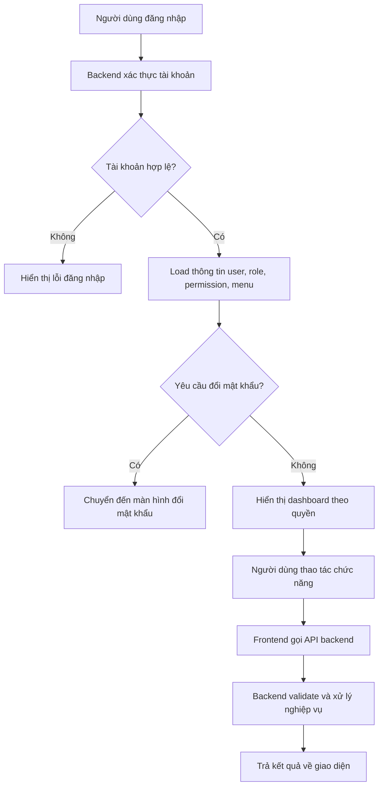

### 3.3.2. Nguyên tắc thiết kế giao diện

Giao diện được xây dựng theo các nguyên tắc:

- Chia chức năng theo module để người dùng dễ tìm kiếm.
- Các màn hình quản lý có dạng danh sách, bộ lọc, form thêm/sửa và màn hình chi tiết.
- Các trường dữ liệu có quan hệ được lọc phụ thuộc, ví dụ chọn khoa rồi mới lọc ngành, chọn ngành rồi mới lọc chuyên ngành.
- Các thao tác thành công hoặc thất bại đều có thông báo phản hồi.
- Các chức năng nhạy cảm như khóa tài khoản, xóa dữ liệu, duyệt yêu cầu cần có xác nhận.
- Menu hiển thị dựa trên vai trò và quyền của người dùng.

## 3.4. Module xác thực, tài khoản và phân quyền

### 3.4.1. Mục tiêu chức năng

Module xác thực và phân quyền cho phép người dùng đăng nhập vào hệ thống, đổi mật khẩu, xử lý đăng nhập lần đầu, gửi yêu cầu quên mật khẩu và truy cập các chức năng theo vai trò được cấp. Admin có thể quản lý người dùng, vai trò, quyền, API permission và menu.

### 3.4.2. Workflow chức năng

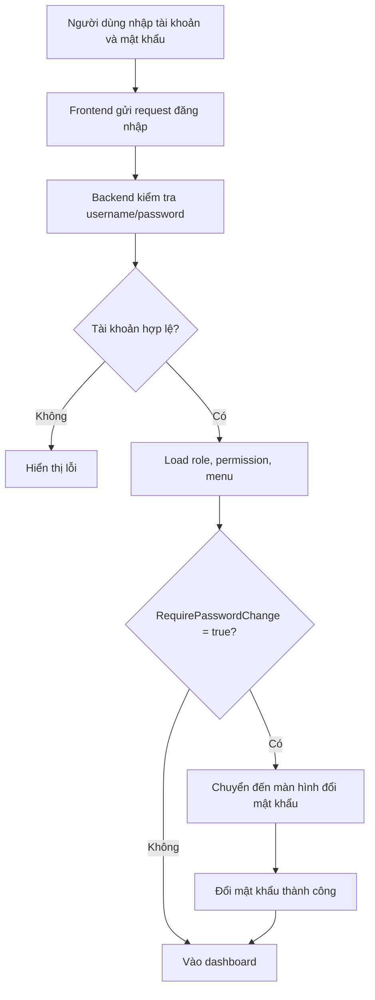

### 3.4.3. Các chức năng đã triển khai

| Chức năng | Mô tả |
|---|---|
| Đăng nhập | Người dùng đăng nhập bằng username và mật khẩu |
| Xem thông tin hiện tại | Lấy thông tin user, role, permission hiện tại |
| Đổi mật khẩu | Người dùng đổi mật khẩu sau khi đăng nhập |
| Đổi mật khẩu bằng token | Cho phép đổi mật khẩu qua token xác nhận |
| Quên mật khẩu | Người dùng gửi yêu cầu reset mật khẩu cho admin |
| Admin duyệt reset mật khẩu | Admin reset mật khẩu về mặc định và yêu cầu đổi lại |
| Quản lý user | Admin xem, sửa, khóa, mở khóa, xóa, khôi phục tài khoản |
| Quản lý role | Admin tạo, sửa, xóa vai trò |
| Quản lý permission | Admin tạo quyền và gán API cho quyền |
| Quản lý menu | Menu được hiển thị theo quyền |

### 3.4.4. Màn hình cần chụp

**Hình 3.1. Màn hình đăng nhập hệ thống**

Mô tả: Màn hình cho phép người dùng nhập tên đăng nhập và mật khẩu để truy cập hệ thống.

**Hình 3.2. Màn hình yêu cầu đổi mật khẩu lần đầu**

Mô tả: Màn hình xuất hiện khi tài khoản có `requirePasswordChange = true`.

**Hình 3.3. Màn hình quên mật khẩu**

Mô tả: Người dùng gửi yêu cầu reset mật khẩu kèm thông tin xác minh.

**Hình 3.4. Màn hình admin xử lý yêu cầu đặt lại mật khẩu**

Mô tả: Admin xem danh sách yêu cầu trong `PasswordResetRequests`, kiểm tra thông tin người dùng và duyệt/từ chối reset mật khẩu.

**Hình 3.5. Màn hình quản lý tài khoản người dùng**

Mô tả: Admin xem danh sách user, khóa/mở khóa tài khoản, cập nhật thông tin user.

**Hình 3.6. Màn hình quản lý vai trò và quyền**

Mô tả: Admin tạo role, gán permission cho role.

**Hình 3.7. Màn hình quản lý menu theo phân quyền**

Mô tả: Admin cấu hình menu hiển thị theo quyền truy cập.

## 3.5. Module quản lý hồ sơ Student - Instructor - Staff

### 3.5.1. Mục tiêu chức năng

Module này cho phép admin tạo và quản lý các đối tượng chính trong hệ thống gồm sinh viên, giảng viên và nhân viên. Khi tạo mới một đối tượng, hệ thống tự động tạo thông tin cá nhân, hồ sơ nghiệp vụ, tài khoản đăng nhập, email nội bộ và vai trò tương ứng.

### 3.5.2. Workflow tạo đối tượng

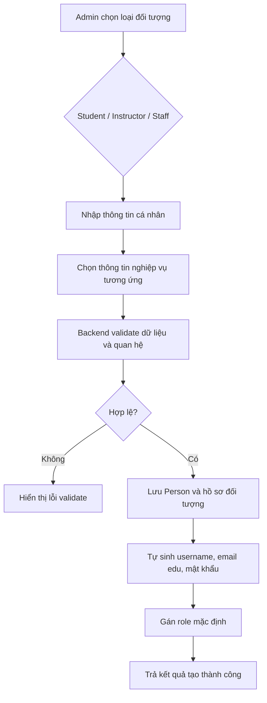

### 3.5.3. Chức năng tạo sinh viên

Khi admin tạo sinh viên, hệ thống xử lý các dữ liệu:

| Nhóm dữ liệu | Nội dung |
|---|---|
| Thông tin cá nhân | Họ tên, ngày sinh, giới tính, CCCD, email cá nhân, số điện thoại, địa chỉ |
| Thông tin đào tạo | Khoa, ngành, chuyên ngành, niên khóa, chương trình đào tạo |
| Thông tin lớp | Lớp hành chính, học kỳ gán lớp |
| Trạng thái | Trạng thái sinh viên ban đầu |
| Tài khoản | Mã sinh viên, username, email edu, mật khẩu mặc định, role STUDENT |

Các trường được tự sinh:

| Trường | Cách xử lý |
|---|---|
| Mã sinh viên | Tự sinh nếu admin không nhập |
| Username | Dựa trên mã sinh viên |
| Email edu | Sinh theo quy tắc email nội bộ |
| Mật khẩu mặc định | Dựa trên ngày sinh |
| Vai trò | Gán role `STUDENT` |

### 3.5.4. Chức năng tạo giảng viên

Khi admin tạo giảng viên, hệ thống tạo thông tin `Person`, `Employee`, `InstructorProfile`, `User` và `UserRole`. Giảng viên được gán khoa/bộ môn, học vị, ngành chuyên môn và mã giảng viên.

Các trường được tự sinh:

| Trường | Cách xử lý |
|---|---|
| EmployeeCode | Tự sinh nếu admin không nhập |
| InstructorCode | Sinh theo mã nhân viên, thường có tiền tố giảng viên |
| Username | Dựa trên mã giảng viên |
| Email edu | Sinh theo quy tắc email nội bộ |
| Vai trò | Gán role `LECTURER` |

### 3.5.5. Chức năng tạo nhân viên

Khi admin tạo nhân viên, hệ thống tạo thông tin `Person`, `Employee`, `Staff`, `User` và `UserRole`. Nhân viên được gán phòng ban và chức vụ.

Các trường được tự sinh:

| Trường | Cách xử lý |
|---|---|
| EmployeeCode | Tự sinh nếu admin không nhập |
| StaffCode | Sinh theo mã nhân viên, thường có tiền tố nhân viên |
| Username | Dựa trên mã staff |
| Email edu | Sinh theo quy tắc email nội bộ |
| Vai trò | Gán role `STAFF` |

### 3.5.6. Màn hình cần chụp

**Hình 3.8. Màn hình danh sách sinh viên**

Mô tả: Hiển thị danh sách sinh viên, bộ lọc theo khoa, ngành, niên khóa, trạng thái.

**Hình 3.9. Màn hình thêm mới sinh viên**

Mô tả: Form nhập thông tin cá nhân và thông tin đào tạo của sinh viên.

**Hình 3.10. Màn hình chọn khoa, ngành, chuyên ngành, niên khóa, chương trình đào tạo khi tạo sinh viên**

Mô tả: Minh họa quan hệ lọc dữ liệu phụ thuộc.

**Hình 3.11. Màn hình kết quả tạo sinh viên và tài khoản**

Mô tả: Hiển thị mã sinh viên, username, email edu, trạng thái yêu cầu đổi mật khẩu.

**Hình 3.12. Màn hình danh sách giảng viên**

Mô tả: Hiển thị danh sách giảng viên theo khoa/bộ môn, học vị, trạng thái.

**Hình 3.13. Màn hình thêm mới giảng viên**

Mô tả: Form nhập thông tin cá nhân, khoa, học vị, ngành chuyên môn.

**Hình 3.14. Màn hình danh sách nhân viên**

Mô tả: Hiển thị danh sách nhân viên theo phòng ban, chức vụ.

**Hình 3.15. Màn hình thêm mới nhân viên**

Mô tả: Form nhập thông tin cá nhân, phòng ban, chức vụ và thông tin công tác.

**Hình 3.16. Màn hình hồ sơ cá nhân của người dùng**

Mô tả: Người dùng tự xem và cập nhật thông tin cá nhân của chính mình.

## 3.6. Module tổ chức nhân sự

### 3.6.1. Mục tiêu chức năng

Module tổ chức nhân sự quản lý các dữ liệu liên quan đến nhân viên và giảng viên như phòng ban, chức vụ, học vị/trình độ, hợp đồng lao động và lịch nghỉ. Các dữ liệu này được sử dụng khi tạo staff, tạo instructor, quản lý hồ sơ công tác và kiểm tra khả dụng giảng viên khi xếp lịch hoặc duyệt lịch bù.

### 3.6.2. Workflow tổ chức nhân sự

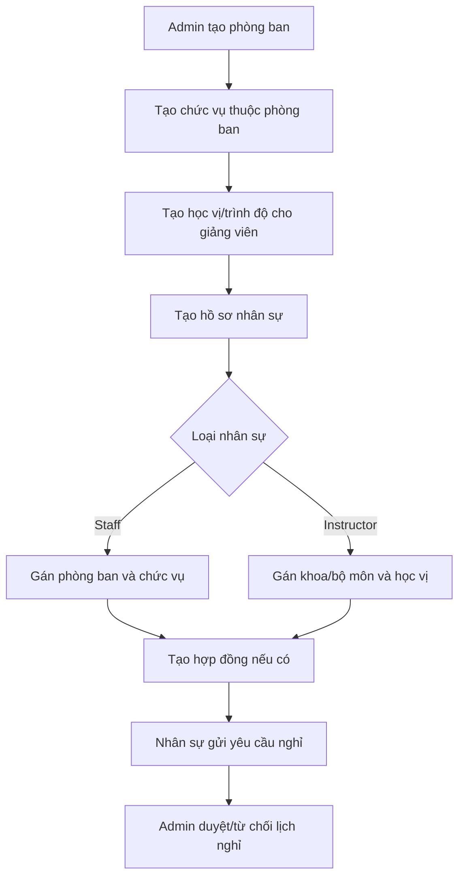

### 3.6.3. Các chức năng đã triển khai

| Chức năng | Mô tả |
|---|---|
| Quản lý phòng ban | Tạo, sửa, xóa, xem danh sách phòng ban |
| Quản lý chức vụ | Chức vụ thuộc phòng ban, dùng khi tạo staff |
| Quản lý học vị/trình độ | Học vị dùng cho hồ sơ giảng viên |
| Quản lý hợp đồng | Theo dõi loại hợp đồng, ngày ký, hiệu lực, lương cơ bản |
| Quản lý lịch nghỉ | Nhân sự gửi yêu cầu nghỉ, admin duyệt hoặc từ chối |
| Kiểm tra khả dụng giảng viên | Lịch nghỉ được dùng làm dữ liệu khi xếp lịch hoặc duyệt dạy bù |

### 3.6.4. Màn hình cần chụp

**Hình 3.17. Màn hình quản lý phòng ban**

Mô tả: Admin quản lý danh sách phòng ban, mã phòng ban, tên phòng ban và trạng thái.

**Hình 3.18. Màn hình quản lý chức vụ**

Mô tả: Admin tạo chức vụ thuộc phòng ban, cấp bậc và phụ cấp nếu có.

**Hình 3.19. Màn hình quản lý học vị/trình độ**

Mô tả: Admin quản lý học vị, học hàm, chuyên ngành đào tạo của giảng viên.

**Hình 3.20. Màn hình quản lý hợp đồng nhân sự**

Mô tả: Admin xem và cập nhật hợp đồng theo nhân viên/giảng viên.

**Hình 3.21. Màn hình gửi yêu cầu nghỉ**

Mô tả: Giảng viên hoặc nhân viên gửi yêu cầu nghỉ kèm thời gian và lý do.

**Hình 3.22. Màn hình admin duyệt lịch nghỉ**

Mô tả: Admin duyệt, từ chối hoặc ghi chú xử lý yêu cầu nghỉ.

## 3.7. Module cấu hình đào tạo

### 3.7.1. Mục tiêu chức năng

Module cấu hình đào tạo dùng để tạo dữ liệu nền phục vụ toàn bộ nghiệp vụ đào tạo. Các dữ liệu này bao gồm khoa, ngành, chuyên ngành, niên khóa, năm học, học kỳ và lớp hành chính.

### 3.7.2. Workflow cấu hình đào tạo

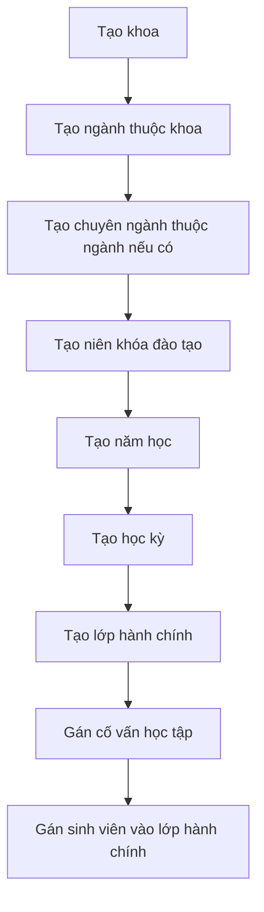

### 3.7.3. Các chức năng đã triển khai

| Chức năng | Mô tả |
|---|---|
| Quản lý khoa | Tạo, sửa, xóa, xem danh sách khoa |
| Quản lý ngành | Ngành thuộc khoa, dùng để lọc sinh viên và chương trình đào tạo |
| Quản lý chuyên ngành | Chuyên ngành thuộc ngành, dùng cho giai đoạn chuyên sâu |
| Quản lý niên khóa | Xác định khóa đào tạo của sinh viên |
| Quản lý năm học | Tạo năm đào tạo |
| Quản lý học kỳ | Học kỳ thuộc năm học, dùng cho lớp học phần, đăng ký, lịch |
| Quản lý lớp hành chính | Lớp theo khoa/ngành/chuyên ngành/niên khóa, có cố vấn học tập |
| Gán sinh viên vào lớp hành chính | Ghi nhận sinh viên thuộc lớp trong học kỳ |
| Quản lý trạng thái sinh viên | Tạo danh mục trạng thái như đang học, bảo lưu, thôi học, cảnh báo |
| Ghi nhận lịch sử trạng thái | Lưu lịch sử thay đổi trạng thái của sinh viên |
| Ghi nhận lịch sử chuyên ngành | Lưu lịch sử sinh viên chọn/chuyển chuyên ngành |

### 3.7.4. Màn hình cần chụp

**Hình 3.23. Màn hình quản lý khoa**

Mô tả: Danh sách khoa, form thêm/sửa khoa.

**Hình 3.24. Màn hình quản lý ngành**

Mô tả: Danh sách ngành, lọc ngành theo khoa.

**Hình 3.25. Màn hình quản lý chuyên ngành**

Mô tả: Tạo chuyên ngành thuộc một ngành và khoa.

**Hình 3.26. Màn hình quản lý niên khóa đào tạo**

Mô tả: Tạo khóa đào tạo, năm bắt đầu, năm kết thúc.

**Hình 3.27. Màn hình quản lý năm học**

Mô tả: Tạo năm học với ngày bắt đầu và kết thúc.

**Hình 3.28. Màn hình quản lý học kỳ**

Mô tả: Học kỳ thuộc năm học, có thời gian bắt đầu/kết thúc.

**Hình 3.29. Màn hình danh sách lớp hành chính**

Mô tả: Hiển thị lớp theo khoa, ngành, niên khóa, cố vấn học tập.

**Hình 3.30. Màn hình thêm mới lớp hành chính**

Mô tả: Form chọn khoa, ngành, chuyên ngành, niên khóa, cố vấn, sĩ số.

**Hình 3.31. Màn hình gán sinh viên vào lớp hành chính theo học kỳ**

Mô tả: Danh sách sinh viên trong lớp và thao tác thêm/xóa sinh viên.

**Hình 3.32. Màn hình quản lý danh mục trạng thái sinh viên**

Mô tả: Admin tạo các trạng thái học tập trong `StudentStatusCatalog`.

**Hình 3.33. Màn hình lịch sử trạng thái sinh viên**

Mô tả: Hiển thị các lần thay đổi trạng thái học tập của sinh viên.

**Hình 3.34. Màn hình lịch sử chọn/chuyển chuyên ngành**

Mô tả: Hiển thị lịch sử phân chuyên ngành hoặc chuyển chuyên ngành của sinh viên.

## 3.8. Module chương trình đào tạo và môn học

### 3.8.1. Mục tiêu chức năng

Module chương trình đào tạo và môn học cho phép admin quản lý danh mục học phần, thiết kế chương trình đào tạo theo khoa, ngành, chuyên ngành và niên khóa. Module này cũng quản lý môn tiên quyết, môn song hành và môn tương đương.

### 3.8.2. Workflow thiết kế chương trình đào tạo

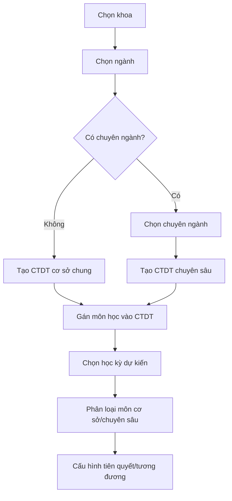

### 3.8.3. Các chức năng đã triển khai

| Chức năng | Mô tả |
|---|---|
| Quản lý môn học | Tạo môn học, số tín chỉ, số tiết lý thuyết/thực hành |
| Quản lý chương trình đào tạo | Tạo chương trình theo khoa, ngành, chuyên ngành, niên khóa |
| Gán môn vào chương trình | Xác định môn học thuộc CTDT và học kỳ dự kiến |
| Phân loại môn | Phân biệt môn cơ sở chung và môn chuyên sâu |
| Quản lý môn tiên quyết | Cấu hình môn phải học trước hoặc học song hành |
| Quản lý môn tương đương | Xác định môn có thể thay thế khi học lại/cải thiện |

### 3.8.4. Màn hình cần chụp

**Hình 3.35. Màn hình danh sách môn học**

Mô tả: Hiển thị danh sách môn học, số tín chỉ, khoa phụ trách.

**Hình 3.36. Màn hình thêm mới môn học**

Mô tả: Form nhập mã môn, tên môn, tín chỉ, số tiết.

**Hình 3.37. Màn hình danh sách chương trình đào tạo**

Mô tả: Hiển thị CTDT theo khoa, ngành, chuyên ngành, niên khóa.

**Hình 3.38. Màn hình thêm mới chương trình đào tạo**

Mô tả: Form tạo CTDT cơ sở hoặc CTDT chuyên ngành.

**Hình 3.39. Màn hình gán môn học vào chương trình đào tạo**

Mô tả: Chọn học kỳ dự kiến, môn học, loại môn, bắt buộc/tự chọn.

**Hình 3.40. Màn hình cấu hình môn tiên quyết**

Mô tả: Thiết lập quan hệ môn học và môn tiên quyết/song hành.

**Hình 3.41. Màn hình cấu hình môn tương đương**

Mô tả: Thiết lập môn học có thể thay thế tương đương.

## 3.9. Module lớp học phần, đăng ký học phần và điểm

### 3.9.1. Mục tiêu chức năng

Module này quản lý lớp học phần được mở theo học kỳ, danh sách sinh viên trong lớp học phần, đợt đăng ký học phần, đăng ký học lại/học cải thiện và điểm học phần. Đây là module trung tâm để theo dõi quá trình học tập của sinh viên.

### 3.9.2. Workflow lớp học phần và điểm

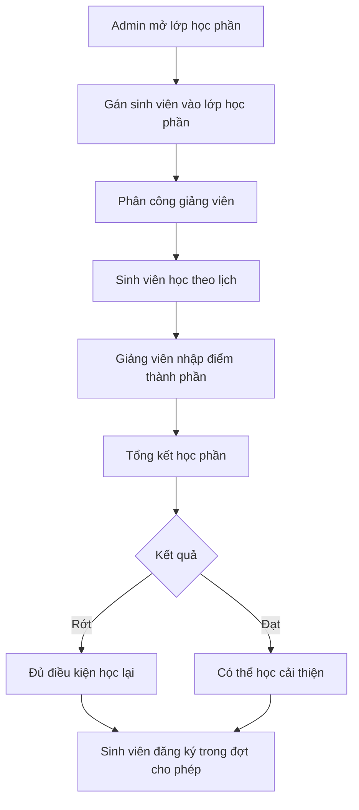

### 3.9.3. Các chức năng đã triển khai

| Chức năng | Mô tả |
|---|---|
| Mở lớp học phần | Tạo lớp theo môn học và học kỳ |
| Quản lý sĩ số | Kiểm tra số lượng sinh viên hiện tại và tối đa |
| Gán sinh viên vào lớp học phần | Ghi nhận sinh viên tham gia học phần |
| Quản lý đợt đăng ký | Tạo thời gian đăng ký, cho phép học lại/cải thiện |
| Đăng ký học lại/cải thiện | Sinh viên đăng ký khi đủ điều kiện điểm và thời gian |
| Cấu hình thành phần điểm | Tạo các cột điểm và trọng số |
| Nhập điểm | Giảng viên/admin nhập điểm thành phần |
| Tổng kết học phần | Tính điểm tổng kết và trạng thái đạt/rớt |

### 3.9.4. Màn hình cần chụp

**Hình 3.42. Màn hình danh sách lớp học phần**

Mô tả: Hiển thị lớp học phần theo học kỳ, môn học, trạng thái.

**Hình 3.43. Màn hình thêm mới lớp học phần**

Mô tả: Form chọn học kỳ, môn học, mã lớp, sĩ số, thời gian học.

**Hình 3.44. Màn hình danh sách sinh viên trong lớp học phần**

Mô tả: Hiển thị sinh viên đã được gán hoặc đã đăng ký vào lớp.

**Hình 3.45. Màn hình quản lý đợt đăng ký học phần**

Mô tả: Cấu hình thời gian đăng ký, giới hạn tín chỉ, cho phép học lại.

**Hình 3.46. Màn hình sinh viên xem lớp đủ điều kiện học lại/cải thiện**

Mô tả: Danh sách lớp học phần có thể đăng ký dựa trên kết quả điểm.

**Hình 3.47. Màn hình sinh viên đăng ký học lại/học cải thiện**

Mô tả: Sinh viên chọn lớp học phần và gửi đăng ký.

**Hình 3.48. Màn hình cấu hình thành phần điểm**

Mô tả: Admin tạo các thành phần điểm như chuyên cần, giữa kỳ, cuối kỳ.

**Hình 3.49. Màn hình nhập điểm của giảng viên**

Mô tả: Giảng viên nhập điểm cho sinh viên trong lớp học phần được phân công.

**Hình 3.50. Màn hình tổng kết điểm học phần**

Mô tả: Hiển thị điểm tổng kết, trạng thái đạt/rớt, điểm chữ.

## 3.10. Module phân công giảng dạy, lịch học và điều chỉnh lịch

### 3.10.1. Mục tiêu chức năng

Module này quản lý việc phân công giảng viên giảng dạy lớp học phần, xếp lịch học, phòng học, tiết học, theo dõi tiến độ giảng dạy và xử lý yêu cầu nghỉ/bù/tăng tiết. Hệ thống giữ lịch gốc trong bảng `Schedules`, các thay đổi phát sinh được xử lý thông qua yêu cầu điều chỉnh và lịch override.

### 3.10.2. Workflow phân công và xếp lịch

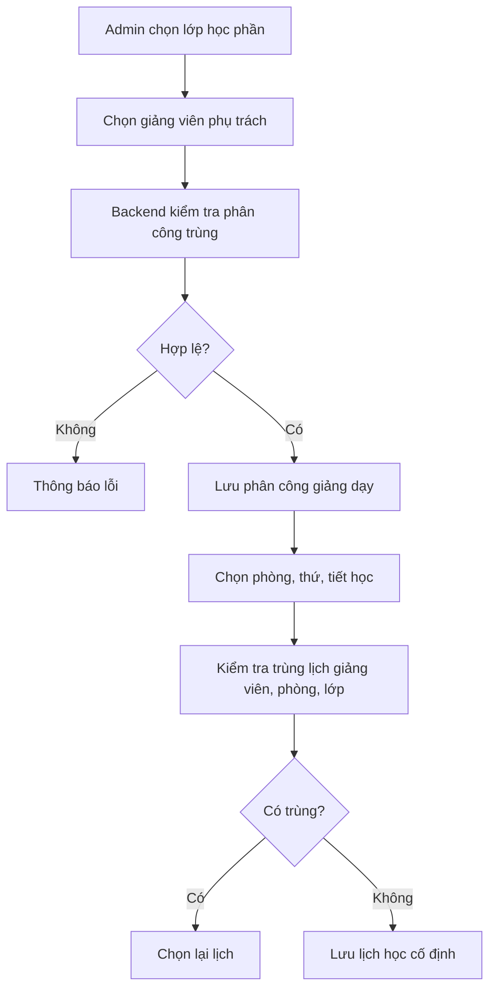

### 3.10.3. Workflow nghỉ/bù/tăng tiết

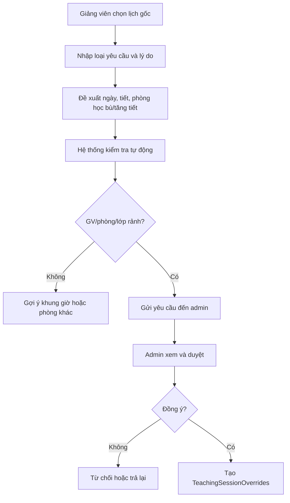

### 3.10.4. Các chức năng đã triển khai

| Chức năng | Mô tả |
|---|---|
| Phân công giảng dạy | Gán giảng viên phụ trách lớp học phần |
| Tạo lịch học | Xếp phòng, ngày, tiết, thời gian học |
| Kiểm tra trùng lịch | Kiểm tra giảng viên, phòng, lớp trong cùng khung giờ |
| Xem lịch tuần | Hiển thị lịch học/lịch dạy theo tuần |
| Tạo yêu cầu điều chỉnh lịch | Giảng viên gửi yêu cầu nghỉ/bù/tăng tiết |
| Kiểm tra khả dụng | Hệ thống kiểm tra tự động phòng, giảng viên, lớp, học kỳ |
| Duyệt yêu cầu | Admin duyệt, từ chối hoặc trả lại yêu cầu |
| Lịch override | Lưu lịch thay thế mà không làm mất lịch gốc |
| Theo dõi tiến độ giảng dạy | Tổng hợp số tiết phải dạy, đã dạy, còn lại |

### 3.10.5. Màn hình cần chụp

**Hình 3.51. Màn hình phân công giảng dạy**

Mô tả: Admin chọn giảng viên, lớp học phần, lớp hành chính và học kỳ.

**Hình 3.52. Màn hình danh sách phân công giảng dạy**

Mô tả: Hiển thị giảng viên nào dạy lớp học phần nào và trạng thái phân công.

**Hình 3.53. Màn hình tạo lịch học**

Mô tả: Chọn phòng học, ngày học, tiết học, số tiết.

**Hình 3.54. Màn hình lịch tuần của giảng viên**

Mô tả: Giảng viên xem lịch dạy theo tuần.

**Hình 3.55. Màn hình lịch học của sinh viên**

Mô tả: Sinh viên xem lịch học theo tuần/học kỳ.

**Hình 3.56. Màn hình gửi yêu cầu nghỉ/bù/tăng tiết**

Mô tả: Giảng viên chọn lịch gốc, nhập lý do, ngày bù, tiết bù, phòng đề xuất.

**Hình 3.57. Màn hình kiểm tra tự động khả dụng lịch bù**

Mô tả: Hiển thị kết quả kiểm tra giảng viên rảnh, phòng rảnh, lớp không trùng lịch, ngày nằm trong học kỳ.

**Hình 3.58. Màn hình admin duyệt yêu cầu điều chỉnh lịch**

Mô tả: Admin xem danh sách yêu cầu, duyệt, từ chối hoặc trả lại.

**Hình 3.59. Màn hình lịch sau khi có override**

Mô tả: Lịch học hiển thị buổi nghỉ, buổi bù hoặc buổi tăng tiết.

**Hình 3.60. Màn hình theo dõi tiến độ giảng dạy**

Mô tả: Hiển thị tổng số tiết học phần, số tiết đã dạy, số tiết còn lại.

## 3.11. Module cơ sở vật chất

### 3.11.1. Mục tiêu chức năng

Module cơ sở vật chất quản lý tòa nhà, phòng học và khung tiết học. Dữ liệu này được sử dụng khi xếp lịch học và kiểm tra phòng còn trống.

### 3.11.2. Workflow quản lý phòng học

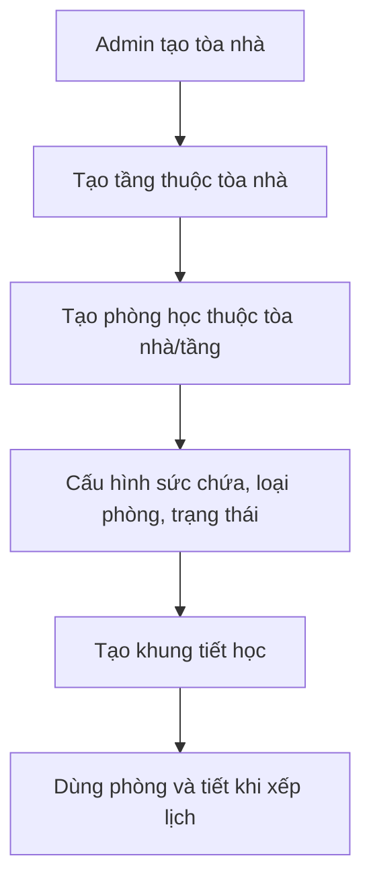

### 3.11.3. Màn hình cần chụp

**Hình 3.61. Màn hình quản lý tòa nhà**

Mô tả: Danh sách tòa nhà, mã tòa nhà, tên, địa chỉ.

**Hình 3.62. Màn hình quản lý tầng**

Mô tả: Danh sách tầng thuộc tòa nhà, mã tầng, số tầng và mô tả.

**Hình 3.63. Màn hình quản lý phòng học**

Mô tả: Danh sách phòng học, sức chứa, loại phòng, trạng thái.

**Hình 3.64. Màn hình quản lý khung tiết học**

Mô tả: Cấu hình tiết học, thời gian bắt đầu và kết thúc.

## 3.12. Kiểm thử chức năng đã triển khai

### 3.12.1. Mục tiêu kiểm thử

Kiểm thử được thực hiện nhằm đảm bảo các chức năng hoạt động đúng theo yêu cầu nghiệp vụ, dữ liệu được lưu chính xác và các ràng buộc quan hệ được kiểm tra trước khi ghi vào cơ sở dữ liệu.

### 3.12.2. Hình thức kiểm thử

| Hình thức | Mục đích |
|---|---|
| Kiểm thử giao diện | Kiểm tra thao tác người dùng trên website |
| Kiểm thử API | Kiểm tra dữ liệu request/response giữa frontend và backend |
| Kiểm thử service | Kiểm tra logic nghiệp vụ trong backend |
| Kiểm thử tích hợp | Kiểm tra luồng nghiệp vụ có tương tác cơ sở dữ liệu |

### 3.12.3. Các kịch bản kiểm thử tiêu biểu

| Kịch bản | Kết quả mong đợi |
|---|---|
| Đăng nhập đúng tài khoản | Vào được hệ thống và hiển thị menu theo quyền |
| Đăng nhập lần đầu | Bị chuyển đến màn hình đổi mật khẩu |
| Admin tạo sinh viên | Sinh viên, tài khoản, role và email edu được tạo |
| User gửi yêu cầu quên mật khẩu | Dữ liệu được lưu vào danh sách chờ admin xử lý |
| Tạo sinh viên chọn sai khoa/ngành | Backend từ chối và trả thông báo lỗi |
| Cập nhật trạng thái sinh viên | Ghi nhận lịch sử trạng thái mới |
| Sinh viên chọn/chuyển chuyên ngành | Ghi nhận lịch sử chuyên ngành |
| Tạo lớp hành chính vượt quan hệ ngành/khoa | Backend từ chối |
| Gán sinh viên vào lớp hết sĩ số | Backend từ chối |
| Mở lớp học phần | Lớp học phần được tạo theo môn và học kỳ |
| Đăng ký học lại khi chưa có điểm finalized | Không hiển thị học phần để đăng ký |
| Đăng ký học lại khi trùng lịch | Backend từ chối |
| Phân công giảng viên trùng lớp học phần | Backend từ chối |
| Tạo lịch trùng phòng hoặc giảng viên | Backend từ chối |
| Giảng viên gửi yêu cầu nghỉ/bù | Hệ thống kiểm tra tự động và tạo yêu cầu |
| Admin duyệt yêu cầu bù | Tạo lịch override và giữ nguyên lịch gốc |
| Giảng viên có lịch nghỉ đã duyệt | Hệ thống cảnh báo/chặn khi xếp lịch hoặc duyệt lịch bù trùng ngày nghỉ |

### 3.12.4. Màn hình cần chụp

**Hình 3.65. Kết quả kiểm thử đăng nhập và phân quyền**

Mô tả: Minh họa user chỉ thấy menu được cấp quyền.

**Hình 3.66. Kết quả kiểm thử tạo sinh viên thành công**

Mô tả: Sinh viên được tạo và có tài khoản hệ thống.

**Hình 3.67. Kết quả kiểm thử validate lỗi khi chọn sai quan hệ**

Mô tả: Giao diện hiển thị thông báo lỗi từ backend.

**Hình 3.68. Kết quả kiểm thử đăng ký học lại/học cải thiện**

Mô tả: Sinh viên chỉ thấy học phần đủ điều kiện.

**Hình 3.69. Kết quả kiểm thử điều chỉnh lịch**

Mô tả: Yêu cầu nghỉ/bù được admin duyệt và tạo lịch override.

## 3.13. Kết quả đạt được

Sau quá trình xây dựng và triển khai, hệ thống đã đáp ứng được các chức năng chính:

- Xác thực người dùng, đổi mật khẩu, quên mật khẩu và phân quyền theo vai trò.
- Admin quản lý tài khoản, vai trò, quyền và menu.
- Admin tạo và quản lý sinh viên, giảng viên, nhân viên; hệ thống tự sinh tài khoản và email nội bộ.
- Quản lý phòng ban, chức vụ, học vị, hợp đồng và lịch nghỉ nhân sự.
- Quản lý dữ liệu nền đào tạo gồm khoa, ngành, chuyên ngành, niên khóa, năm học, học kỳ.
- Quản lý trạng thái sinh viên, lịch sử trạng thái, lớp sinh viên theo học kỳ và lịch sử chọn/chuyển chuyên ngành.
- Quản lý lớp hành chính, gán cố vấn và gán sinh viên vào lớp.
- Quản lý môn học, chương trình đào tạo, môn trong chương trình, môn tiên quyết và môn tương đương.
- Mở lớp học phần, quản lý danh sách sinh viên trong lớp học phần.
- Quản lý điểm thành phần, tổng kết điểm và hỗ trợ đăng ký học lại/học cải thiện.
- Phân công giảng dạy, xếp lịch học, kiểm tra trùng lịch, xử lý yêu cầu nghỉ/bù/tăng tiết.
- Theo dõi tiến độ giảng dạy theo lớp học phần.

Các chức năng trên được triển khai theo hướng module hóa, có sự liên kết dữ liệu chặt chẽ giữa các phân hệ. Điều này giúp hệ thống dễ mở rộng, dễ bảo trì và phù hợp với quy trình quản lý đào tạo thực tế trong trường đại học.

## 3.14. Gợi ý danh sách hình ảnh đưa vào báo cáo

| STT | Tên hình | Module |
|---:|---|---|
| 1 | Màn hình đăng nhập hệ thống | Auth/RBAC |
| 2 | Màn hình đổi mật khẩu lần đầu | Auth/RBAC |
| 3 | Màn hình quản lý tài khoản | Auth/RBAC |
| 4 | Màn hình quản lý vai trò và quyền | Auth/RBAC |
| 5 | Màn hình danh sách sinh viên | Student |
| 6 | Màn hình thêm mới sinh viên | Student |
| 7 | Màn hình kết quả tạo tài khoản sinh viên | Student |
| 8 | Màn hình danh sách giảng viên | Instructor |
| 9 | Màn hình thêm mới giảng viên | Instructor |
| 10 | Màn hình danh sách nhân viên | Staff |
| 11 | Màn hình thêm mới nhân viên | Staff |
| 12 | Màn hình quản lý khoa | Academic |
| 13 | Màn hình quản lý ngành | Academic |
| 14 | Màn hình quản lý chuyên ngành | Academic |
| 15 | Màn hình quản lý niên khóa | Academic |
| 16 | Màn hình quản lý học kỳ | Academic |
| 17 | Màn hình quản lý lớp hành chính | Class |
| 18 | Màn hình quản lý môn học | Course |
| 19 | Màn hình quản lý chương trình đào tạo | Curriculum |
| 20 | Màn hình gán môn vào chương trình đào tạo | Curriculum |
| 21 | Màn hình quản lý lớp học phần | CourseClass |
| 22 | Màn hình danh sách sinh viên trong lớp học phần | CourseRegistration |
| 23 | Màn hình đăng ký học lại/học cải thiện | Registration |
| 24 | Màn hình nhập điểm | Grade |
| 25 | Màn hình tổng kết điểm | Grade |
| 26 | Màn hình phân công giảng dạy | Teaching |
| 27 | Màn hình lịch tuần | Schedule |
| 28 | Màn hình gửi yêu cầu nghỉ/bù/tăng tiết | Schedule Adjustment |
| 29 | Màn hình admin duyệt yêu cầu điều chỉnh lịch | Schedule Adjustment |
| 30 | Màn hình theo dõi tiến độ giảng dạy | Teaching Progress |
