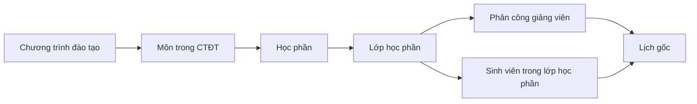
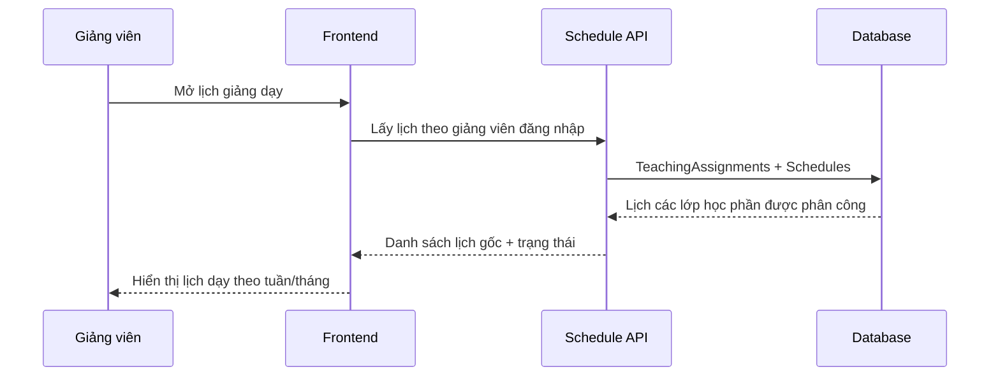
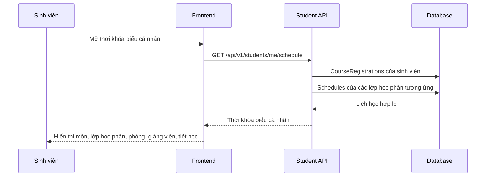

# Demo luồng lịch gốc theo chương trình đào tạo

## 1. Phạm vi demo

Luồng này chỉ demo lịch gốc cho các môn đã nằm trong chương trình đào tạo theo khoa/ngành. Tạm thời chưa xử lý phần sinh viên tự đăng ký học lại hoặc học cải thiện.

Nguồn dữ liệu chính:

## 2. Dữ liệu demo đã seed

Migration `V42__Seed_Course_Class_Auto_Schedule_Workflow.sql` tạo:

- Time slot chuẩn: `T1-3`, `T4-6`, `T7-9`, `T10-12`.
- Lớp học phần HK1-2026: `CNTT102.01`, `CNTT104.01`, `SE301.01`, `CS301.01`, `ACC301.01`.
- Phân công giảng viên theo khoa/ngành.
- Gán sinh viên đủ điều kiện vào lớp học phần qua `CourseRegistrations`.

Migration `V43__Seed_Default_Fixed_Schedules_Demo.sql` tạo lịch gốc cố định:

| Lớp học phần | Học phần | Phòng | Tiết | Ngày mẫu |
| --- | --- | --- | --- | --- |
| CNTT102.01 | Cơ sở lập trình | B101 | T1-3 | Thứ 2, Thứ 4 |
| CNTT104.01 | Cơ sở dữ liệu | B102 | T4-6 | Thứ 3, Thứ 5 |
| SE301.01 | Chuyên sâu KTPM | A201 | T7-9 | Thứ 2, Thứ 4 |
| CS301.01 | Chuyên sâu KHMT | A102 | T7-9 | Thứ 3, Thứ 5 |
| ACC301.01 | Chuyên sâu kế toán | A101 | T4-6 | Thứ 2, Thứ 4 |

## 3. Vai trò Admin

Admin kiểm soát toàn bộ luồng tại các màn hình:

- Chương trình đào tạo: xem học phần cơ sở/chuyên sâu theo khoa, ngành, khóa.
- Lớp học phần: mở lớp học phần theo học kỳ, gán giảng viên, gán sinh viên.
- Lịch học: xem lịch theo tuần/tháng/ngày, lọc theo khoa, giảng viên, phòng, lớp học phần.
- Tự động xếp lịch: hệ thống dùng hard constraint để tránh trùng phòng, trùng giảng viên, trùng lớp học phần trong cùng học kỳ, thứ và tiết.

Luồng thao tác demo:

1. Vào `Quản lý chương trình đào tạo`, mở chi tiết CTĐT để thấy môn cơ sở và môn chuyên sâu.
2. Vào `Lớp học phần`, kiểm tra lớp đã có học phần, học kỳ, giảng viên và danh sách sinh viên.
3. Vào `Lịch học`, lọc HK1-2026 để thấy lịch gốc đã seed.
4. Nếu cần tạo thêm lịch, dùng chức năng tự động xếp lịch cho học kỳ. Hệ thống chỉ xếp các tiết còn thiếu theo số tín chỉ/số tiết đã cấu hình.

## 4. Vai trò Giảng viên

Giảng viên chỉ nhìn thấy các lớp học phần được phân công qua `TeachingAssignments`.

Luồng dữ liệu:

Nếu giảng viên cần nghỉ/bù/tăng tiết, luồng đó đi qua request/override, không sửa trực tiếp lịch gốc.

## 5. Vai trò Sinh viên

Sinh viên chỉ nhìn thấy lịch của các lớp học phần mà mình đã được gán vào qua `CourseRegistrations`.

Luồng dữ liệu:

## 6. Ràng buộc nghiệp vụ chính

- Một lịch gốc không được trùng phòng trong cùng học kỳ, thứ và tiết.
- Một giảng viên không được dạy hai lớp học phần cùng học kỳ, thứ và tiết.
- Một lớp học phần không được có hai lịch cùng thứ và tiết.
- Lịch gốc không bị sửa khi có nghỉ/bù/tăng tiết; thay đổi phát sinh được ghi qua `ScheduleAdjustmentRequests` và `TeachingSessionOverrides`.
- Sinh viên chỉ thấy lịch nếu có bản ghi `CourseRegistrations` đang hoạt động.
- Giảng viên chỉ thấy lịch nếu có bản ghi `TeachingAssignments` đang hoạt động.

## 7. Điểm nhấn demo

Thông điệp nên trình bày:

> Hệ thống không chỉ lưu lịch học rời rạc. Lịch được sinh từ chuỗi nghiệp vụ đầy đủ: chương trình đào tạo quyết định môn học, môn học mở thành lớp học phần, lớp học phần được phân công giảng viên và gán sinh viên, sau đó lịch gốc mới được hiển thị theo đúng vai trò.

