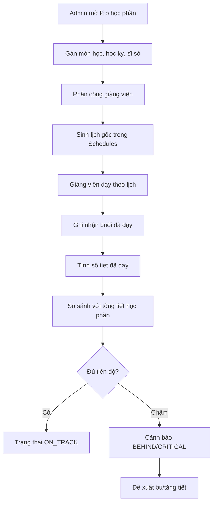
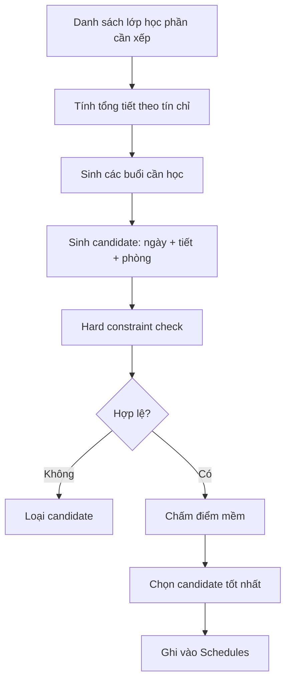
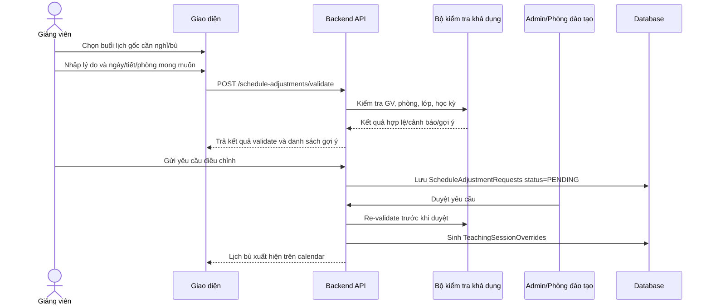

# Kịch bản thuyết trình: Tiến độ giảng dạy, lịch gốc và lịch bù

Tài liệu này dùng để trình bày trong báo cáo bảo vệ hoặc demo hệ thống. Nội dung tập trung vào 2 điểm sáng của module Teaching/Schedule:

- Theo dõi tiến độ giảng dạy theo lớp học phần.
- Tự động lập lịch gốc và xử lý lịch bù/tăng tiết bằng request + override.

---

## 1. Thông điệp chính khi trình bày

Không nên trình bày module lịch như một màn hình thời khóa biểu thông thường. Điểm cần nhấn mạnh là:

> Hệ thống không chỉ lưu lịch học, mà còn kiểm soát tiến độ thực dạy, phát hiện thiếu tiết, xử lý nghỉ/bù/tăng tiết có kiểm tra xung đột tự động và vẫn giữ nguyên lịch gốc để đảm bảo truy vết nghiệp vụ.

Ba ý lớn cần nói:

1. Lịch gốc là kế hoạch đào tạo chính thức.
2. Lịch bù/tăng tiết là phát sinh thực tế, không ghi đè trực tiếp lên lịch gốc.
3. Tiến độ giảng dạy được tính từ số tiết học phần, số tiết đã dạy, số buổi nghỉ và các buổi bù đã được duyệt.

---

## 2. Tổng quan tiến độ giảng dạy

### 2.1. Mục tiêu chức năng

Chức năng tiến độ giảng dạy giúp phòng đào tạo theo dõi mỗi lớp học phần đã dạy được bao nhiêu tiết so với kế hoạch.

Ví dụ:

| Thành phần | Ý nghĩa |
|---|---|
| Lớp học phần | Mã lớp học phần, ví dụ `IT301.001` |
| Học phần | Tên môn + số tín chỉ |
| Tổng tiết học phần | Quy đổi từ tín chỉ |
| Đã dạy | Số tiết thực tế đã hoàn thành |
| GV nghỉ | Số buổi giảng viên nghỉ/hoãn |
| Còn lại | Tổng tiết phải dạy - số tiết đã dạy |
| Cảnh báo | Đúng tiến độ, chậm tiến độ, nguy cơ thiếu tiết |

### 2.2. Quy đổi tín chỉ sang số tiết

Quy tắc quy đổi:

| Loại tín chỉ | Công thức |
|---|---|
| Lý thuyết | `1 tín chỉ = 15 tiết` |
| Thực hành/thí nghiệm | `1 tín chỉ = 30 tiết` |
| Thực tập | `1 tín chỉ = 45 tiết` |

Ví dụ môn 3 tín chỉ lý thuyết:

```text
Tổng tiết = 3 x 15 = 45 tiết
```

### 2.3. Luồng xử lý nghiệp vụ



### 2.4. Kịch bản thuyết trình phần tiến độ dạy

**Người trình bày nói:**

> Ở phần tiến độ giảng dạy, nhóm em không chỉ quản lý thời khóa biểu ở mức ngày giờ, mà còn theo dõi xem lớp học phần đã thực hiện được bao nhiêu tiết so với kế hoạch đào tạo.

> Ví dụ một học phần 3 tín chỉ lý thuyết cần 45 tiết. Khi giảng viên hoàn thành từng buổi dạy, hệ thống ghi nhận số tiết đã dạy. Nếu có buổi nghỉ hoặc hoãn, số tiết còn lại sẽ tăng áp lực về cuối kỳ.

> Từ đó phòng đào tạo có thể biết lớp nào đang đúng tiến độ, lớp nào đang chậm, lớp nào có nguy cơ thiếu tiết trước khi kết thúc học kỳ. Đây là cơ sở để duyệt học bù hoặc tăng tiết một cách có kiểm soát.

**Câu nhấn mạnh:**

> Điểm quan trọng là tiến độ được tính từ dữ liệu thực tế sau khi lịch gốc và lịch điều chỉnh được ghép lại, chứ không chỉ dựa vào kế hoạch ban đầu.

### 2.5. Gợi ý demo màn hình

Thứ tự demo:

1. Mở danh sách lớp học phần.
2. Chọn một lớp học phần.
3. Xem môn học, số tín chỉ, giảng viên, ngày bắt đầu/kết thúc.
4. Mở bảng tiến độ giảng dạy.
5. Chỉ vào các cột: tổng tiết, đã dạy, nghỉ, còn lại, cảnh báo.
6. Mô tả tình huống: giảng viên nghỉ một buổi nên hệ thống báo cần bù.

---

## 3. Lên lịch gốc

### 3.1. Vai trò của lịch gốc

Lịch gốc là lịch chính thức được phòng đào tạo lập đầu học kỳ. Lịch này lưu trong bảng `Schedules`.

Lịch gốc gồm:

- Lớp học phần.
- Giảng viên phụ trách.
- Phòng học.
- Thứ/ngày học.
- Ca/tiết học.
- Ngày bắt đầu, ngày kết thúc.
- Số tiết mỗi buổi.

### 3.2. Ràng buộc khi xếp lịch gốc

Các ràng buộc cứng:

| Ràng buộc | Ý nghĩa |
|---|---|
| Giảng viên không trùng lịch | Một giảng viên không thể dạy 2 lớp cùng thời điểm |
| Phòng không trùng lịch | Một phòng không thể có 2 lớp cùng lúc |
| Lớp học phần không trùng lịch | Sinh viên của lớp không bị xếp 2 môn cùng thời điểm |
| Lịch nằm trong học kỳ | Ngày học phải thuộc khoảng thời gian học kỳ |
| Đủ tổng số tiết | Số buổi sinh ra phải đủ tổng tiết của môn |

Các ràng buộc mềm:

| Ràng buộc | Ý nghĩa |
|---|---|
| Ưu tiên phòng đủ sức chứa | Phòng có sức chứa phù hợp sĩ số |
| Ưu tiên cùng tòa/khu học | Giảm di chuyển giữa các buổi |
| Tránh dồn quá nhiều tiết trong một ngày | Giúp lịch học hợp lý hơn |
| Cân bằng tải giảng viên | Tránh một giảng viên bị dồn lịch quá nhiều |

### 3.3. Thuật toán sử dụng cho lịch gốc

Hiện tại hướng triển khai phù hợp với quy mô dự án là:

```text
Greedy Scheduling + Hard Constraint Check
```

Cách hiểu đơn giản:

1. Sắp xếp các lớp học phần cần xếp lịch.
2. Với mỗi lớp học phần, sinh danh sách khung giờ/phòng khả dụng.
3. Kiểm tra từng khung giờ theo ràng buộc cứng.
4. Chọn phương án hợp lệ tốt nhất theo điểm ưu tiên.
5. Ghi lịch vào `Schedules`.



### 3.4. Kịch bản thuyết trình phần lịch gốc

**Người trình bày nói:**

> Sau khi admin mở lớp học phần và phân công giảng viên, hệ thống sẽ lập lịch gốc. Lịch gốc là kế hoạch chính thức của học kỳ và được lưu trong bảng Schedules.

> Khi xếp lịch, hệ thống kiểm tra các ràng buộc cứng như giảng viên không được trùng lịch, phòng học không được trùng, lớp học phần không bị xung đột và lịch phải nằm trong học kỳ.

> Với các phương án hợp lệ, hệ thống ưu tiên phòng đủ sức chứa, giảm di chuyển, tránh dồn tiết và cân bằng lịch dạy. Cách xử lý này phù hợp với bài toán quy mô vừa của trường, dễ kiểm soát và dễ giải thích trong nghiệp vụ.

**Câu nhấn mạnh:**

> Lịch gốc không phải được nhập rời rạc từng dòng, mà được sinh có kiểm tra ràng buộc để hạn chế lỗi xếp lịch thủ công.

---

## 4. Lịch bù, nghỉ và tăng tiết

### 4.1. Vì sao không sửa trực tiếp lịch gốc?

Trong thực tế, giảng viên có thể:

- Nghỉ một buổi dạy.
- Xin dạy bù vào ngày khác.
- Xin tăng tiết để đẩy nhanh tiến độ.
- Xin đổi phòng.
- Xin đổi ca do bận lịch công tác.

Nếu sửa trực tiếp vào lịch gốc, hệ thống sẽ mất dấu kế hoạch ban đầu. Vì vậy thiết kế hiện tại dùng mô hình:

```text
Schedules = lịch gốc
ScheduleAdjustmentRequests = yêu cầu điều chỉnh
TeachingSessionOverrides = lịch thay thế sau khi được duyệt
```

### 4.2. Luồng xử lý lịch bù



### 4.3. Thuật toán gợi ý lịch bù

Lịch bù dùng:

```text
Generate Candidates + Hard Filter + Soft Scoring
```

Khác với lịch gốc, lịch bù không xếp lại toàn bộ học kỳ mà chỉ tìm phương án tốt cho một phát sinh cụ thể.

Các bước:

1. Sinh các candidate từ ngày, tiết, phòng có thể học bù.
2. Loại ngay candidate vi phạm ràng buộc cứng.
3. Chấm điểm các candidate còn lại.
4. Trả về top gợi ý để giảng viên/admin chọn.

### 4.4. Hard filter

Candidate bị loại nếu vi phạm một trong các điều kiện:

| Kiểm tra | Mô tả |
|---|---|
| Giảng viên trùng lịch | GV đã có lớp khác cùng ngày/tiết |
| Phòng trùng lịch | Phòng đã có lớp khác hoặc override đã duyệt |
| Lớp học phần trùng lịch | Lớp đã có lịch khác cùng thời điểm |
| Ngoài học kỳ | Ngày bù nằm ngoài thời gian học kỳ |
| Ngày giảng viên nghỉ | GV có lịch nghỉ/đơn nghỉ đã duyệt |
| Request đang giữ chỗ | Có yêu cầu pending khác đang đề xuất cùng slot |

### 4.5. Soft scoring

Candidate hợp lệ được chấm điểm:

| Tiêu chí | Điểm ưu tiên |
|---|---|
| Phòng đủ sức chứa | Cao |
| Cùng tòa/khu với lịch gốc | Cao |
| Ngày không quá gần kỳ thi | Cao |
| Không dồn quá nhiều tiết trong ngày | Cao |
| Gần ngày nghỉ cần bù | Trung bình |
| Đúng slot giảng viên đề xuất | Cao |

Ví dụ kết quả gợi ý:

```text
✅ GV không có lịch thứ 5, ngày 19/12, tiết 7-9
✅ Phòng A201 còn trống
✅ Lớp IT301.001 không bị trùng lịch
✅ Ngày bù nằm trong học kỳ
⚠️ Còn 7 ngày trước kỳ thi, cần thông báo sớm cho sinh viên
```

### 4.6. Kịch bản thuyết trình phần lịch bù

**Người trình bày nói:**

> Trong thực tế, lịch học không cố định tuyệt đối. Giảng viên có thể nghỉ do công tác, bệnh hoặc cần học bù để đảm bảo đủ số tiết. Nếu sửa trực tiếp lịch gốc thì hệ thống sẽ mất lịch sử và khó kiểm soát.

> Vì vậy nhóm em thiết kế lịch gốc và lịch phát sinh tách biệt. Lịch gốc vẫn nằm trong bảng Schedules. Khi có phát sinh, giảng viên gửi yêu cầu điều chỉnh kèm lý do, ngày bù, tiết bù và phòng mong muốn.

> Trước khi gửi, hệ thống tự động kiểm tra giảng viên có trùng lịch không, phòng có trống không, lớp học phần có bị trùng không, ngày bù có nằm trong học kỳ không và có gần kỳ thi không. Nếu có nhiều phương án, hệ thống gợi ý các slot tốt nhất theo điểm ưu tiên.

> Khi admin duyệt, hệ thống không xóa hay sửa lịch gốc mà tạo một bản override trong TeachingSessionOverrides. Nhờ vậy calendar cuối cùng vẫn hiển thị đúng thực tế, nhưng phòng đào tạo vẫn truy vết được kế hoạch ban đầu và lý do thay đổi.

**Câu nhấn mạnh:**

> Đây là điểm khác biệt quan trọng: lịch gốc phục vụ kế hoạch, override phục vụ thực tế, còn tiến độ giảng dạy là nơi tổng hợp cả hai.

---

## 5. Kịch bản demo 3 phút cho hội đồng

### Bước 1: Mở lịch gốc

**Thao tác:** Admin mở màn hình lớp học phần hoặc thời khóa biểu.

**Lời nói:**

> Đây là lịch gốc của lớp học phần, được sinh theo học kỳ, giảng viên, phòng học và ca học. Lịch này là kế hoạch chính thức ban đầu.

### Bước 2: Tạo yêu cầu nghỉ/bù

**Thao tác:** Chuyển sang vai trò giảng viên, chọn một buổi dạy, nhập lý do nghỉ và ngày bù mong muốn.

**Lời nói:**

> Giảng viên không tự sửa lịch chính thức. Thay vào đó, giảng viên gửi yêu cầu điều chỉnh kèm lý do để phòng đào tạo kiểm soát.

### Bước 3: Validate/gợi ý tự động

**Thao tác:** Nhấn kiểm tra khả dụng.

**Lời nói:**

> Hệ thống kiểm tra tự động: giảng viên có rảnh không, phòng còn trống không, lớp có trùng lịch không và ngày bù có hợp lệ không. Nếu có cảnh báo như gần ngày thi, hệ thống vẫn cho biết để admin cân nhắc.

### Bước 4: Admin duyệt

**Thao tác:** Admin mở danh sách yêu cầu, xem validate result và duyệt.

**Lời nói:**

> Khi duyệt, backend kiểm tra lại một lần nữa để tránh trường hợp dữ liệu thay đổi trong lúc chờ duyệt. Nếu hợp lệ, hệ thống sinh lịch override.

### Bước 5: Xem calendar và tiến độ

**Thao tác:** Mở calendar/tổng quan tiến độ.

**Lời nói:**

> Calendar cuối cùng được ghép từ lịch gốc và lịch override. Tiến độ giảng dạy cũng dựa trên dữ liệu đã ghép này để tính số tiết đã dạy, còn lại và cảnh báo thiếu tiến độ.

---

## 6. Slide gợi ý cho phần này

### Slide 1: Vấn đề thực tế

- Lịch học thay đổi do giảng viên nghỉ/công tác.
- Xếp lịch thủ công dễ trùng phòng, trùng giảng viên.
- Phòng đào tạo cần biết lớp nào thiếu tiết.
- Cần giữ lịch sử thay đổi để truy vết.

Hình gợi ý: sơ đồ lịch gốc → phát sinh → duyệt → lịch thực tế.

### Slide 2: Thiết kế giải pháp

- `Schedules`: lịch gốc.
- `ScheduleAdjustmentRequests`: yêu cầu nghỉ/bù/tăng tiết.
- `TeachingSessionOverrides`: lịch thay thế đã duyệt.
- `TeachingProgress`: tổng hợp tiến độ dạy.

Hình gợi ý: sơ đồ 4 khối dữ liệu liên kết.

### Slide 3: Thuật toán lịch gốc

- Greedy Scheduling.
- Hard Constraint Check.
- Chấm điểm ưu tiên.
- Ghi lịch hợp lệ vào `Schedules`.

Hình gợi ý: flowchart generate candidate → validate → score → save.

### Slide 4: Thuật toán lịch bù

- Generate Candidates.
- Hard Filter.
- Soft Scoring.
- Trả top gợi ý.

Hình gợi ý: bảng candidate với trạng thái hợp lệ/cảnh báo.

### Slide 5: Giá trị đạt được

- Giảm lỗi trùng lịch.
- Có cảnh báo tiến độ dạy.
- Giữ được lịch gốc và lịch sử điều chỉnh.
- Hỗ trợ phòng đào tạo ra quyết định nhanh hơn.

---

## 7. Câu trả lời mẫu khi hội đồng hỏi

### Câu hỏi: Vì sao không sửa trực tiếp lịch gốc?

Trả lời:

> Vì lịch gốc là kế hoạch đào tạo chính thức. Nếu sửa trực tiếp, hệ thống sẽ mất dấu kế hoạch ban đầu và không biết buổi nào là phát sinh. Do đó nhóm em dùng override để lưu phần thay đổi, vừa hiển thị đúng lịch thực tế vừa giữ được lịch sử điều chỉnh.

### Câu hỏi: Thuật toán lịch bù khác gì lịch gốc?

Trả lời:

> Lịch gốc xếp nhiều lớp học phần cho cả học kỳ nên dùng hướng Greedy Scheduling kết hợp kiểm tra ràng buộc. Lịch bù chỉ xử lý một phát sinh cụ thể nên dùng Generate Candidates, Hard Filter và Soft Scoring để tìm các phương án phù hợp nhất.

### Câu hỏi: Hệ thống biết lớp nào chậm tiến độ bằng cách nào?

Trả lời:

> Hệ thống quy đổi tín chỉ sang tổng số tiết cần dạy, sau đó so sánh với số tiết thực tế đã dạy và các buổi bù đã được duyệt. Nếu số tiết còn lại lớn so với thời gian còn lại của học kỳ, hệ thống chuyển trạng thái cảnh báo.

### Câu hỏi: Nếu phòng hoặc giảng viên bị trùng sau khi gửi yêu cầu thì sao?

Trả lời:

> Khi giảng viên gửi yêu cầu, hệ thống đã validate một lần. Khi admin duyệt, backend re-validate lần nữa. Nếu trong thời gian chờ duyệt có request khác chiếm phòng hoặc giảng viên phát sinh lịch mới, hệ thống sẽ chặn duyệt để tránh trùng lịch.

---

## 8. Kết luận ngắn để kết thúc phần trình bày

> Với module này, hệ thống không chỉ giải quyết bài toán lưu thời khóa biểu mà còn quản lý được vòng đời thực tế của hoạt động giảng dạy: từ kế hoạch ban đầu, phát sinh nghỉ/bù, duyệt điều chỉnh đến theo dõi tiến độ. Đây là phần giúp phần mềm tiệm cận nghiệp vụ thật của phòng đào tạo trong trường đại học.
