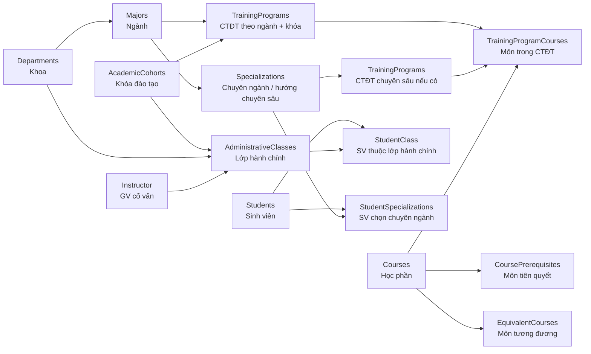
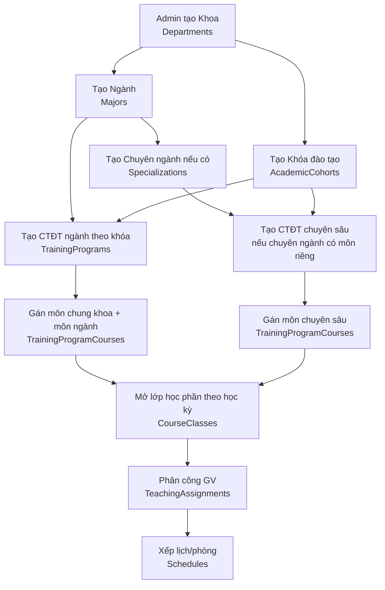
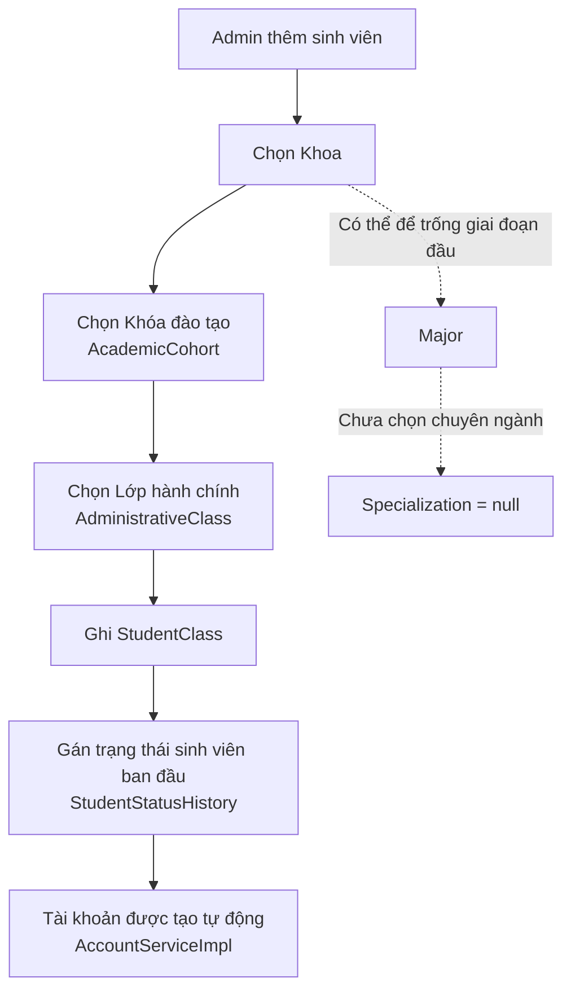
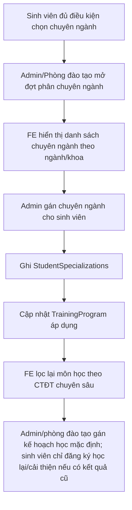
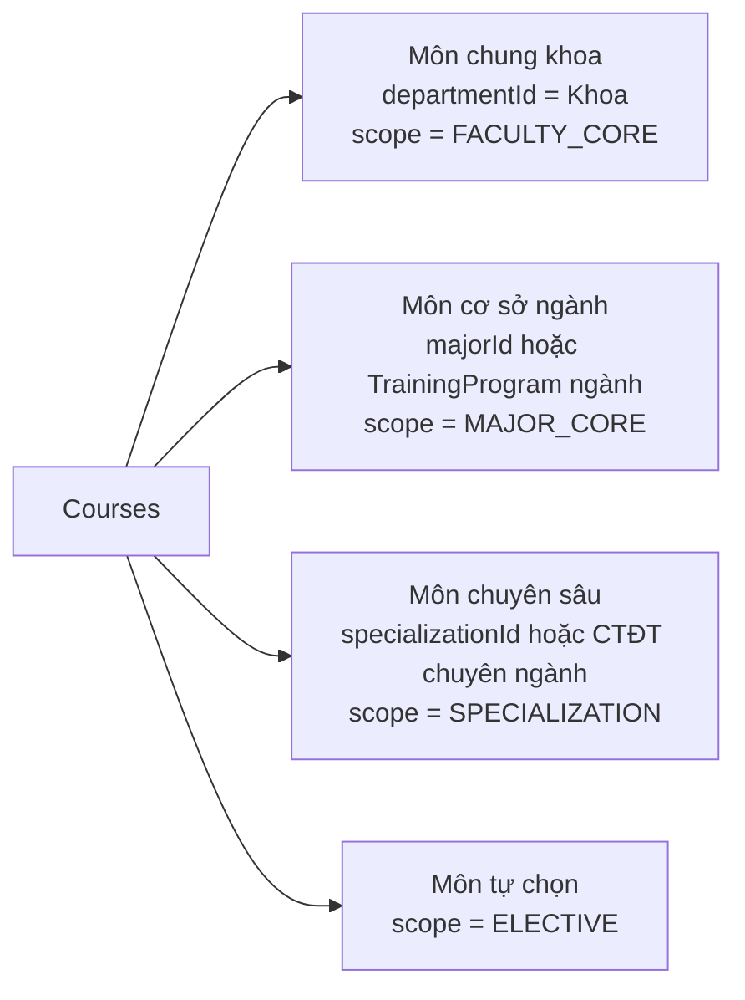
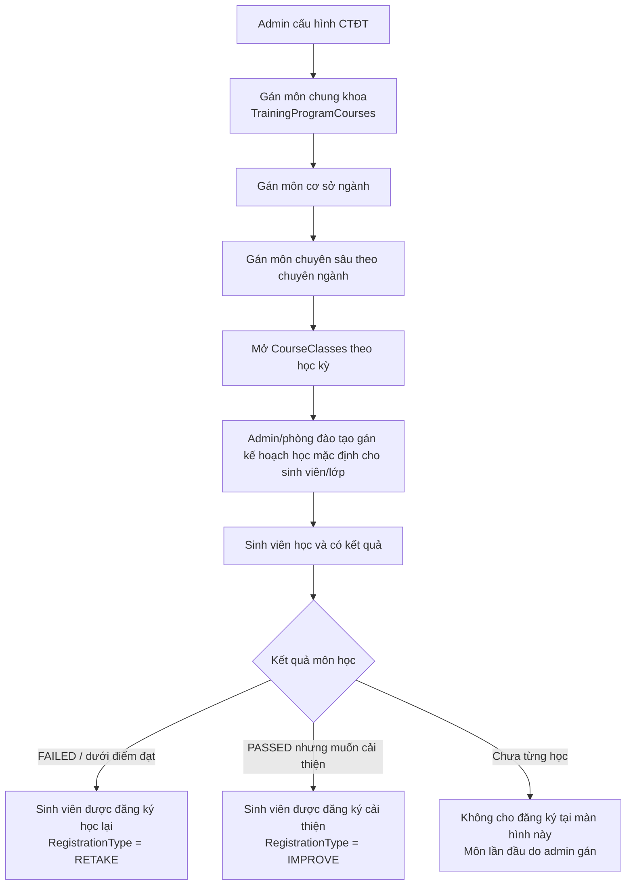
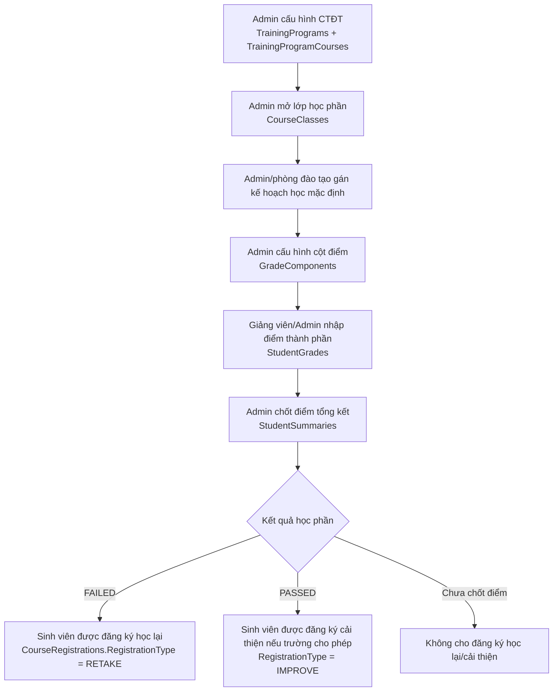
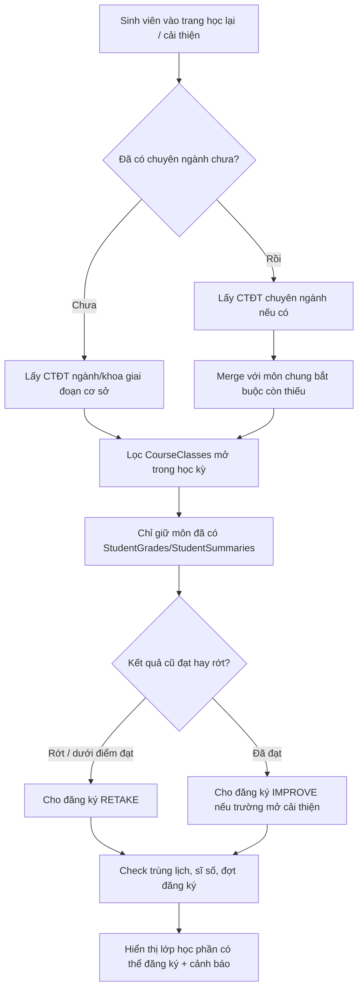
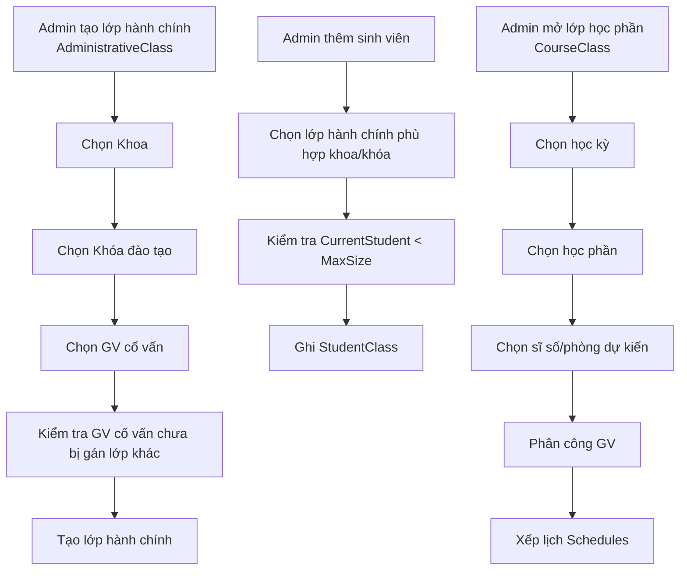

Tổng quan mối quan hệ các bảng
Majors (Ngành học)
  └─► TrainingPrograms (Chương trình đào tạo)
          └─► TrainingProgramCourses (Môn học trong CTĐT)
                    └─► Courses (Môn học)
                              ├─► CoursePrerequisites (Tiên quyết)
                              └─► EquivalentCourses (Tương đương)
                                        │
                              CourseClasses (Lớp học phần/kỳ)
                                        │
                         RegistrationPeriods (Đợt đăng ký)
                                        │
                         CourseRegistrations (Phiếu đăng ký)

Luồng 1 — Admin chuẩn bị đầu kỳ
Bước 1: Tạo Semester (học kỳ mới)
        │
        ▼
Bước 2: Mở CourseClasses (lớp học phần)
        │
        ├─► Chọn Course (môn học)
        ├─► Chọn Instructor (giảng viên phụ trách)
        ├─► Chọn Semester
        ├─► MaxStudents (sĩ số tối đa)
        ├─► MinStudents (sĩ số tối thiểu để mở lớp)
        └─► Status = OPEN (sẵn sàng nhận đăng ký)
        │
        ▼
Bước 3: Tạo RegistrationPeriods (đợt đăng ký)
        │
        ├─► SemesterId
        ├─► StartDate / EndDate (08:00 01/08 → 17:00 07/08)
        ├─► MinCredits = 12 / MaxCredits = 25
        ├─► AllowRetake = true/false
        ├─► TargetConfig → đối tượng sinh viên nào được đăng ký
        └─► Status = UPCOMING → OPEN → CLOSED
        │
        ▼
Bước 4: Assign TeachingAssignments + Schedules
        (phân công lịch dạy, phòng học cho từng lớp)

Luồng 2 — Sinh viên đăng ký học lại / học cải thiện
Sinh viên login → vào trang Đăng ký học lại / học cải thiện
        │
        ▼
GATE 1: Kiểm tra đợt đăng ký có mở không
        │
        ├─► RegistrationPeriods.Status = OPEN?          → Không: "Chưa đến đợt đăng ký"
        ├─► NOW() >= StartDate AND NOW() <= EndDate?     → Không: "Ngoài thời gian đăng ký"
        └─► StudentId có trong TargetConfig?             → Không: "Không thuộc đối tượng đợt này"
        │
        ▼
GATE 2: Kiểm tra trạng thái sinh viên
        │
        ├─► StudentStatusHistory.IsCurrent = true
        ├─► AllowRegister = true?                        → Không: "Đang bảo lưu/đình chỉ"
        └─► WarningLevel < MAX?                          → Vượt: "Cảnh báo học vụ — không được đăng ký"
        │
        ▼
Sinh viên xem danh sách CourseClasses còn mở cho học lại / cải thiện
        │
        ├─► Lọc theo TrainingProgramCourses của CTĐT hiện hành
        │       └─► Chỉ hiển thị môn thuộc CTĐT mà sinh viên đã từng học hoặc có kết quả
        ├─► Không hiển thị môn học lần đầu; học phần lần đầu do admin/phòng đào tạo gán theo kế hoạch đào tạo
        ├─► Hiển thị: Tên môn, Tín chỉ, Giảng viên, Lịch học, Còn chỗ
        └─► Badge: [Học lại] [Cải thiện] [Đã đăng ký học lại] [Đã đăng ký cải thiện]
        │
        ▼
Sinh viên chọn môn → nhấn [Đăng ký]
        │
        ▼
GATE 3: Validate từng môn đăng ký
        │
        ├─► A. Kiểm tra môn tiên quyết (CoursePrerequisites)
        │       │
        │       ├─► Lấy danh sách PrerequisiteCourseId của môn này
        │       ├─► Với mỗi môn tiên quyết:
        │       │       └─► Check StudentGrades/StudentSummaries
        │       │               có điểm >= điểm đạt không?
        │       ├─► Nếu chưa qua tiên quyết:
        │       │       └─► Kiểm tra EquivalentCourses
        │       │               môn tương đương đã học chưa?
        │       └─► Vẫn chưa đủ → "Chưa hoàn thành môn tiên quyết: [Tên môn]"
        │
        ├─► B. Kiểm tra đã học/đang học môn này chưa
        │       │
        │       ├─► Đã có CourseRegistration Status=CONFIRMED môn này kỳ này?
        │       │       └─► "Đã đăng ký môn này rồi"
        │       ├─► Đã có điểm đạt môn này (StudentSummaries)?
        │       │       └─► AllowRetake = false → "Đã hoàn thành môn này"
        │       │       └─► AllowRetake = true  → cho đăng ký IMPROVE
        │       └─► Điểm không đạt → cho đăng ký RETAKE
        │
        ├─► C. Kiểm tra trùng lịch học (Schedules)
        │       │
        │       ├─► Lấy tất cả Schedule của lớp muốn đăng ký
        │       ├─► So sánh với Schedule của các lớp đã đăng ký
        │       └─► Trùng DayOfWeek + TimeSlotId → "Trùng lịch với môn [Tên môn]"
        │
        ├─► D. Kiểm tra sĩ số lớp
        │       │
        │       ├─► COUNT(CourseRegistrations WHERE CourseClassId=? AND Status=CONFIRMED)
        │       ├─► >= CourseClass.MaxStudents?
        │       └─► "Lớp đã đầy — còn 0 chỗ"
        │
        └─► E. Kiểm tra tổng tín chỉ
                │
                ├─► Tính tổng tín chỉ đã đăng ký trong đợt này
                ├─► + Tín chỉ môn muốn thêm
                ├─► < MinCredits → cảnh báo (chưa đủ, không chặn)
                └─► > MaxCredits → "Vượt quá số tín chỉ tối đa (25TC)"
        │
        ▼
GATE 4: Xử lý concurrency (nhiều SV đăng ký cùng lúc)
        │
        ├─► Dùng ROWVERSION optimistic lock
        ├─► Double-check sĩ số trong transaction
        │       SELECT COUNT(*) ... WITH (UPDLOCK, ROWLOCK)
        ├─► Nếu conflict → "Lớp vừa hết chỗ — vui lòng chọn lớp khác"
        └─► Không dùng pessimistic lock → tránh deadlock khi nhiều SV
        │
        ▼
INSERT CourseRegistrations
        │
        ├─► StudentId, CourseClassId, RegistrationPeriodId
        ├─► RegistrationType = RETAKE / IMPROVE
        ├─► ReplacedGradeId = CourseRegistrationId của lần học cũ đã có StudentSummaries
        ├─► RegisteredAt = NOW()
        ├─► Status = CONFIRMED
        ├─► IsPaid = false
        └─► RowVersion tự động
        │
        ▼
Cập nhật CurrentEnrollment của CourseClass
        │
        ▼
Trả về response: Đăng ký thành công

Luồng 3 — Sinh viên hủy đăng ký
Sinh viên nhấn [Hủy đăng ký] môn đã đăng ký
        │
        ▼
GATE 1: Còn trong thời gian đăng ký không?
        └─► NOW() > RegistrationPeriods.EndDate → "Hết hạn hủy đăng ký"

GATE 2: Môn này đã có điểm chưa?
        └─► Có điểm → "Không thể hủy — đã có điểm"

GATE 3: Nếu hủy thì còn đủ MinCredits không?
        └─► Tổng TC - TC môn hủy < MinCredits
            → Cảnh báo: "Sẽ dưới mức tín chỉ tối thiểu"
        │
        ▼
UPDATE CourseRegistrations
        └─► Status = CANCELLED
        └─► CurrentEnrollment của CourseClass - 1

Luồng 4 — Sau khi kết thúc đợt đăng ký
RegistrationPeriods.EndDate qua → Status = CLOSED
        │
        ▼
Hệ thống tự động (Scheduled Job):
        │
        ├─► Kiểm tra CourseClasses có đủ MinStudents không
        │       └─► < MinStudents → Status = CANCELLED
        │               → Thông báo SV lớp bị hủy
        │               → SV được đăng ký lại lớp khác (nếu có)
        │
        ├─► Tạo StudentTuition
        │       └─► Tính học phí dựa trên tổng tín chỉ đã đăng ký
        │
        └─► Gửi email xác nhận lịch học cho SV

Validate đầy đủ — Bảng tổng hợp
┌──────┬────────────────────────────────┬────────────────────────────────────┐
│ Gate │ Điều kiện kiểm tra             │ Lỗi trả về                         │
├──────┼────────────────────────────────┼────────────────────────────────────┤
│  1   │ Đợt đăng ký đang OPEN         │ Chưa/Hết đợt đăng ký               │
│  1   │ Đúng thời gian StartDate/End  │ Ngoài thời gian đăng ký            │
│  1   │ Sinh viên thuộc TargetConfig  │ Không thuộc đối tượng đợt này      │
├──────┼────────────────────────────────┼────────────────────────────────────┤
│  2   │ AllowRegister = true          │ Đang bảo lưu / đình chỉ            │
│  2   │ WarningLevel < MAX            │ Cảnh báo học vụ                    │
├──────┼────────────────────────────────┼────────────────────────────────────┤
│  3A  │ Đủ môn tiên quyết            │ Chưa hoàn thành: [Tên môn]         │
│  3A  │ Môn tương đương được công nhận│ (tự động pass nếu có equivalent)   │
│  3B  │ Chưa đăng ký môn này kỳ này  │ Đã đăng ký rồi                     │
│  3B  │ Có kết quả cũ để học lại/cải thiện│ Chưa từng học — môn lần đầu do admin gán │
│  3C  │ Không trùng lịch             │ Trùng lịch với: [Tên môn]          │
│  3D  │ Lớp chưa đầy                 │ Lớp đã đầy (còn N chỗ)            │
│  3E  │ Không vượt MaxCredits        │ Vượt tín chỉ tối đa (25TC)         │
├──────┼────────────────────────────────┼────────────────────────────────────┤
│  4   │ ROWVERSION không conflict     │ Lớp vừa hết chỗ — chọn lớp khác   │
└──────┴────────────────────────────────┴────────────────────────────────────┘

Điểm đặc biệt quan trọng
EquivalentCourses tham gia validate tiên quyết:
Môn "Lập trình OOP" yêu cầu tiên quyết "Lập trình Java cũ"
    └─► SV học chương trình mới chưa có "Java cũ"
    └─► Hệ thống check EquivalentCourses
    └─► "Lập trình Java cũ" ≡ "Lập trình Cơ bản mới"
    └─► SV đã học "Lập trình Cơ bản mới" → PASS ✅
TrainingProgramCourses lọc môn hiển thị:
SV ngành CNTT → chỉ thấy môn thuộc CTĐT ngành CNTT
SV ngành Kế toán → chỉ thấy môn thuộc CTĐT ngành Kế toán
Không bị lẫn lộn môn của ngành khác
RegistrationType ảnh hưởng tính điểm:
RETAKE  → dùng khi kết quả cũ FAILED hoặc điểm dưới ngưỡng đạt; sau khi học lại, lấy điểm theo quy chế để cập nhật StudentSummaries
IMPROVE → dùng khi kết quả cũ PASSED nhưng sinh viên muốn cải thiện; lấy điểm cao hơn hoặc theo quy chế của trường


mới thêm  specialization, studentspecialization , mỗi major sẽ có tương ứng tranningprogram tương ứng. có couses môn học và bổ sung thêm logic nghiệp vụ chức năng Tiến độ giảng dạy — theo dõi từng buổi dạy thực tế so với kế hoạch. Phân tích đầy đủ:
Lớp học tập  → CourseClasses.CourseClassCode
Học phần     → Courses.Name + Credits
Bắt đầu      → CourseClasses.StartDate
Kết thúc     → CourseClasses.EndDate
Tiết HP      → Tổng số tiết theo tín chỉ (15 tiết/TC)
GV_nghi      → Số buổi giảng viên vắng/nghỉ
Đã dạy       → Số buổi đã dạy thực tế
Còn          → Tiết HP - Đã dạy (còn lại phải dạy)

Quy đổi tín chỉ → số tiết
Chuẩn phòng đào tạo thường quy định:
    1 tín chỉ = 15 tiết lý thuyết
    1 tín chỉ = 30 tiết thực hành/thí nghiệm
    1 tín chỉ = 45 tiết thực tập
    3TC → 45 tiết   (3 x 15 = 45) ← lý thuyết
    2TC → 30 tiết   (2 x 15 = 30)
    1TC → 15 tiết   (1 x 15 = 15) học phần nó bao gồm CoursePrerequisites “ môn tiên quyết”,equivalent_courses (Môn tương đương)	 
  nó cũng sẽ được gán cho TrainingProgramCourses, để thực hiện chức năng đăng kí học lại học phần theo logic nghiệp vụ  Course_class Lớp học phần mở theo học kỳ semester , course_registrations ( CHI TIẾT ĐĂNG KÍ ), registration_periods ( Đợt đăng kí học phần), validate chuẩn đầy đủ cho nghiệp vụ này .sau đó Assign TeachingAssignments phân công giảng dạy + Schedules
        (phân công lịch dạy, phòng học cho từng lớp) phải kiểm tra validate đầy đủ ngày đó giảng viên xin nghỉ hoặc giảng viên phân công trùng...

---

# Workflow học vụ thật cho FE: Khoa - Ngành - Chuyên ngành - Chương trình đào tạo - Môn học

Phần này mô tả workflow nghiệp vụ theo cách FE có thể dựng màn hình. Mục tiêu là làm rõ khác biệt giữa:

- Môn chung của khoa.
- Môn theo ngành.
- Môn chuyên sâu/chuyên ngành.
- Sinh viên vào trường có thể chưa chọn chuyên ngành, sau năm 2 hoặc năm 3 mới phân nhánh.

## 1. Mô hình quan hệ tổng quan



## 2. Nguyên tắc nghiệp vụ

| Thành phần | Vai trò | FE cần hiểu |
|---|---|---|
| `Departments` | Khoa, ví dụ Công nghệ thông tin | Màn hình chọn khoa là tầng lọc đầu tiên. |
| `Majors` | Ngành, ví dụ CNTT, Khoa học dữ liệu | Một khoa có nhiều ngành. |
| `Specializations` | Chuyên ngành/hướng chuyên sâu, ví dụ AI, Web, An toàn thông tin | Có thể chọn sau năm 2 hoặc năm 3. Không bắt buộc có ngay khi tạo sinh viên. |
| `AcademicCohorts` | Khóa đào tạo, ví dụ K2026 | Dùng để biết sinh viên học theo khóa nào. |
| `TrainingPrograms` | Chương trình đào tạo | Gắn theo ngành + khóa; sau phân nhánh có thể có CTĐT riêng theo chuyên ngành. |
| `TrainingProgramCourses` | Danh sách môn trong CTĐT | FE dùng để lọc môn được phép hiển thị/đăng ký. |
| `Courses` | Học phần | Có thể là môn chung khoa, môn ngành, môn chuyên sâu. |
| `StudentSpecializations` | Lịch sử/ghi nhận sinh viên chọn chuyên ngành | Sau khi chọn chuyên ngành, FE phải đổi bộ môn/chương trình tương ứng. |

## 3. Workflow admin cấu hình dữ liệu đào tạo



## 4. Workflow tạo sinh viên năm nhất

Sinh viên mới vào trường thường chưa cần chọn chuyên ngành sâu.



Quy tắc:

- `majorId` có thể chưa bắt buộc nếu trường xếp sinh viên chung theo khoa ở năm 1.
- `specializationId` nên `null` cho đến khi sinh viên phân chuyên ngành.
- Sinh viên vẫn có thể học các môn cơ sở/chung khoa theo CTĐT giai đoạn đại cương/cơ sở.

## 5. Workflow sau năm 2/năm 3: sinh viên chọn chuyên ngành 
" chưa oke cần thiết kế lại"



Điểm quan trọng:

- Không sửa mất lịch sử cũ; `StudentSpecializations` nên lưu thời điểm bắt đầu áp dụng.
- Sau khi sinh viên có chuyên ngành, FE phải ưu tiên CTĐT chuyên ngành nếu có.
- Nếu chuyên ngành không có CTĐT riêng, tiếp tục dùng CTĐT ngành.

## 6. Phân loại môn học để FE hiển thị



Nếu DB hiện chưa có cột `scope`, FE/backend vẫn có thể suy ra bằng `TrainingProgramCourses`:

| Cách suy ra | Ý nghĩa |
|---|---|
| Course nằm trong CTĐT chung của khoa/ngành ở các học kỳ đầu | Môn chung khoa hoặc môn cơ sở ngành. |
| Course chỉ nằm trong CTĐT của một chuyên ngành | Môn chuyên sâu. |
| Course nằm trong nhiều CTĐT/ngành | Môn dùng chung/liên ngành. |
| Course nằm trong nhóm tự chọn của CTĐT | Môn tự chọn. |

## 6.1. Logic chuẩn đã hiệu chỉnh: môn học mặc định do admin gán, sinh viên chỉ đăng ký học lại/cải thiện

Trong mô hình này, trang đăng ký học phần của sinh viên không dùng để sinh viên tự chọn toàn bộ môn học lần đầu. Kế hoạch học chính khóa được phòng đào tạo/admin thiết lập sẵn theo CTĐT.



Quy tắc backend/FE:

| Trường hợp | Có hiển thị ở màn hình đăng ký học lại/cải thiện? | RegistrationType |
|---|---:|---|
| Môn thuộc CTĐT nhưng sinh viên chưa từng học, chưa có điểm | Không | Không tạo `CourseRegistrations` từ sinh viên |
| Môn thuộc CTĐT, đã học nhưng rớt | Có | `RETAKE` |
| Môn thuộc CTĐT, đã đạt nhưng được phép cải thiện | Có | `IMPROVE` |
| Môn không thuộc CTĐT hiện hành của sinh viên | Không | Không cho đăng ký |

Vì vậy FE cần phân biệt hai nhóm màn hình:

| Nhóm màn hình | Người thao tác | Mục đích |
|---|---|---|
| Kế hoạch học chính khóa | Admin/phòng đào tạo | Gán môn/lớp mặc định cho sinh viên theo khoa, ngành, chuyên ngành, khóa, CTĐT. |
| Đăng ký học lại/cải thiện | Sinh viên | Chỉ chọn lại lớp học phần của môn đã có kết quả cũ. |

## 6.2. Thứ tự nghiệp vụ chuẩn để đăng ký học lại/cải thiện chạy đúng

Đăng ký học lại/cải thiện chỉ mở sau khi hệ thống đã có kết quả học phần chính thức. Vì vậy thứ tự đúng là:



Các bảng điểm theo thiết kế database:

| Bảng | Vai trò |
|---|---|
| `GradeComponents` | Cấu hình các cột điểm của học phần: chuyên cần, giữa kỳ, cuối kỳ, thực hành... kèm tỷ trọng. |
| `StudentGrades` | Điểm thành phần của một sinh viên trong một lần học, khóa bởi `CourseRegistrationId + GradeComponentId`. |
| `GradeScales` | Thang điểm quy đổi: khoảng điểm, chữ điểm, GPA. |
| `StudentSummaries` | Kết quả tổng kết đã chốt của một lần học. Đây là nguồn chính để xác định `RETAKE` hoặc `IMPROVE`. |

API backend tương ứng:

| API | Vai trò |
|---|---|
| `GET /api/v1/admin/grades/components?courseId=...` | Xem cột điểm của học phần. |
| `POST /api/v1/admin/grades/components` | Tạo cột điểm cho học phần. |
| `PUT /api/v1/admin/grades/components/{componentId}` | Cập nhật cột điểm. |
| `POST /api/v1/admin/grades/registrations/{courseRegistrationId}/component-scores` | Nhập/cập nhật điểm thành phần. |
| `GET /api/v1/admin/grades/registrations/{courseRegistrationId}/component-scores` | Xem điểm thành phần. |
| `POST /api/v1/admin/grades/registrations/{courseRegistrationId}/finalize` | Chốt điểm tổng kết vào `StudentSummaries`. |
| `GET /api/v1/admin/grades/registrations/{courseRegistrationId}/summary` | Xem điểm tổng kết một lần học. |
| `GET /api/v1/admin/grades/students/{studentId}/summaries` | Xem toàn bộ kết quả học phần đã chốt của sinh viên. |

Luồng `RegistrationService` hiện dùng `StudentSummaries`:

- Không có `StudentSummaries` đã chốt cho môn đó → chặn đăng ký, vì đây là môn học lần đầu do admin/phòng đào tạo gán.
- `StudentSummaries.Result = FAILED` hoặc `TotalScore < 4.0` → tạo đăng ký `RETAKE`.
- `StudentSummaries.Result = PASSED` hoặc `TotalScore >= 4.0` → tạo đăng ký `IMPROVE`.
- `CourseRegistrations.ReplacedGradeId` lưu `CourseRegistrationId` của lần học cũ để sau này module điểm biết bản ghi nào được thay thế/cải thiện.
- Vẫn kiểm tra đợt đăng ký, sĩ số, môn thuộc CTĐT hiện hành và trùng lịch với các lớp đã đăng ký.

## 7. FE lọc môn học lại / học cải thiện theo trạng thái sinh viên
" chưa oke "


## 8. Ví dụ thực tế: Khoa CNTT

```text
Khoa: Công nghệ thông tin

Ngành:
- Công nghệ thông tin
- Khoa học dữ liệu
- Hệ thống thông tin

Môn chung khoa / cơ sở:
- Nhập môn lập trình
- Cấu trúc dữ liệu và giải thuật
- Cơ sở dữ liệu
- Mạng máy tính
- Hệ điều hành

Chuyên ngành AI:
- Machine Learning
- Deep Learning
- Computer Vision

Chuyên ngành Web:
- Web Backend
- Web Frontend
- DevOps

Chuyên ngành An toàn thông tin:
- Mật mã học
- An toàn mạng
- Kiểm thử xâm nhập
```

FE khi sinh viên chưa chọn chuyên ngành:

- Hiển thị môn chung khoa/cơ sở.
- Ẩn hoặc khóa môn chuyên sâu.
- Có thể hiển thị badge `Cần chọn chuyên ngành`.

FE khi sinh viên đã chọn AI:

- Hiển thị môn chung còn thiếu.
- Hiển thị môn ngành bắt buộc.
- Hiển thị môn chuyên sâu AI.
- Không hiển thị môn chuyên sâu Web/An toàn thông tin, trừ khi được cấu hình là tự chọn mở rộng.

## 9. Workflow lớp hành chính và lớp học phần



Phân biệt:

| Loại lớp | Bảng | Vai trò |
|---|---|---|
| Lớp hành chính | `AdministrativeClasses` | Lớp quản lý sinh viên theo khóa/khoa, có GV cố vấn. |
| Sinh viên thuộc lớp hành chính | `StudentClass` | Ghi nhận sinh viên đang thuộc lớp nào. |
| Lớp học phần | `CourseClasses` | Lớp mở cho một môn trong một học kỳ. |
| Sinh viên đăng ký học lại/cải thiện | `CourseRegistrations` | Sinh viên đăng ký lại lớp học phần cho môn đã rớt hoặc muốn cải thiện. |

## 10. Gợi ý màn hình FE

| Màn hình | Dữ liệu chính | Hành vi |
|---|---|---|
| Quản lý Khoa | `Departments` | CRUD khoa. |
| Quản lý Ngành | `Majors` | Lọc theo khoa. |
| Quản lý Chuyên ngành | `Specializations` | Lọc theo ngành. |
| Quản lý CTĐT | `TrainingPrograms` | Chọn ngành, khóa, chuyên ngành nếu có. |
| Gán môn CTĐT | `TrainingProgramCourses` | Chia tab: môn chung, môn ngành, môn chuyên sâu, tự chọn. |
| Thêm sinh viên | `Students`, `StudentClass` | Chọn khoa/khóa/lớp hành chính; chuyên ngành có thể để trống. |
| Phân chuyên ngành | `StudentSpecializations` | Chọn sinh viên đủ điều kiện, gán chuyên ngành, cập nhật CTĐT áp dụng. |
| Đăng ký học lại/cải thiện | `CourseClasses`, `TrainingProgramCourses`, `StudentGrades`, `Schedules` | Chỉ hiển thị môn trong CTĐT đã có kết quả cũ; rớt thì RETAKE, đạt thì IMPROVE. |
